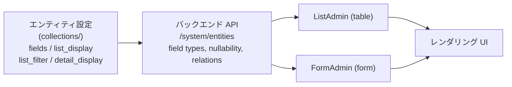

# crud-admin

<p align="center">
  <b>Vue 3、Element Plus、EasyAdmin による設定駆動型管理パネル</b>
  <br><br>
  
  
  
  
  <br><br>
</p>

> English: [README.md](README.md) · 简体中文: [README.zh-cn.md](README.zh-cn.md) · 繁體中文: [README.zh-Hant.md](README.zh-Hant.md)

> バックエンド： [crud-skeleton](https://github.com/immane/crud-skeleton) — Symfony 8.1 API、動的クエリエンジン、モジュラーアーキテクチャ

## スクリーンショット

<p align="center">
  
  
  
  <br>
  <em>ダッシュボード · 一覧ビュー · 詳細ビュー</em>
</p>

## 目次

- [機能](#機能)
- [技術スタック](#技術スタック)
- [国際化](#国際化)
- [プロジェクト構成](#プロジェクト構成)
- [はじめに](#はじめに)
- [設定](#設定)
- [EasyAdmin CRUD エンジン](#easyadmin-crud-エンジン)
- [API 統合](#api-統合)
- [ドキュメント](#ドキュメント)
- [テスト](#テスト)
- [デプロイ](#デプロイ)
- [ライセンス](#ライセンス)

## 機能

- **設定駆動型 CRUD エンジン（EasyAdmin）** — 設定でエンティティを宣言するだけで、リスト/フォーム/詳細/ルートを自動生成
- **21 種類のプラグ可能なフォームフィールド** — input、textarea、select、boolean、integer、currency、date、datetime、image、file、JSON、JSON Schema、リッチテキスト、リレーションピッカー、トランスファー、パスワード（二重入力＋強度ヒント）、メール（形式検証）など
- **フォームバリデーション** — 宣言的な `field.rules` / `field.validator` を `el-form` にマージし、プラグイン向けに `registerFieldValidator` を provide、有効になるまで送信をブロック
- **JSON Schema フォーム** — JSON オブジェクトを国際化対応のネスト FormAdmin コントロールとして描画し、Ajv で検証；静的または非同期 Schema プロバイダーに対応
- **フォールバックチェーン付き詳細ビュー** — フィールド型ごとに `detail/` → `list/` → プレーンテキストプラグイン
- **国際化（i18n）** — 英語、簡体字中国語、繁体字中国語、日本語；ブラウザ言語自動検出；ナビゲーションバーの言語切替；`Accept-Language` ヘッダーと `_locale` パラメータを API リクエストに自動注入
- **JWT 認証** — Bearer トークンログイン、リフレッシュトークンの自動ローテーション、ポート分離 Cookie 永続化（`dream_studio_admin_token_{port}` で同一ホストのポート間衝突を回避）、同時リクエストキューイング
- **ロールベースのアクセス制御** — Vuex + Vue Router 4 によるユーザーロール別の動的ルートフィルタリング
- **エンティティイントロスペクション** — バックエンド `/system/entities` に問い合わせてフィールド型、null 許容、リレーションを自動推論
- **動的フィルタとソート** — 設定駆動の検索 UI からサーバーサイドフィルタ式を生成（`@filter`、`@sort`、`@order`）
- **エンタープライズダッシュボード** — リアルタイムの注文/商品/ユーザー指標、SVG スパークラインチャート、位置情報天気ウィジェット
- **レスポンシブレイアウト** — 折りたたみ可能なサイドバー（SVG アイコン）、パンくずナビゲーション、固定ヘッダーオプション
- **コード分割とビルド最適化** — Vite によるチャンク分割とツリーシェイキング
- **サーバーヘルスモニター** — ナビゲーションバーのステータスドットが `GET /health/live`、`/health/ready`、`/metrics` をポーリング
- **Vitest ユニットテスト** — 78 スペックファイル・1041 テスト、`src/components/EasyAdmin` に 100% カバレッジ閾値
- **追跡対象のロックファイル** — 再現可能なインストールのため `package-lock.json` をコミット


## 技術スタック

| コンポーネント | 技術 |
|-----------|-----------|
| フレームワーク | Vue 3.5 |
| UI ライブラリ | Element Plus 2.9 |
| 状態管理 | Vuex 4 |
| ルーティング | Vue Router 4 |
| HTTP | Axios |
| ビルド | Vite 5 |
| CSS | SCSS (Dart Sass) |
| アイコン | @element-plus/icons-vue + SVG スプライト |
| テスト | Vitest 2.1 |
| 型 | TypeScript 6.0 |
| バックエンド | [crud-skeleton](https://github.com/immane/crud-skeleton) (Symfony 8.1) |

## 国際化

初回ロード時にブラウザ言語を検出し、`localStorage` で選択を永続化します。ナビゲーションバーのドロップダウンからいつでも言語を切り替えられます——切り替え時にエンティティキャッシュをクリアし、ページをリロードします。

| 言語 | コード | Element Plus | API ヘッダー |
|--------|------|-------------|------------|
| English（デフォルト） | `en` | en | `Accept-Language: en`, `_locale=en` |
| 中文 (简体) | `zh` | zh-cn | `Accept-Language: zh`, `_locale=zh` |
| 中文 (繁體) | `zh-Hant` | zh-tw | `Accept-Language: zh-Hant`, `_locale=zh-Hant` |
| 日本語 | `ja` | ja | `Accept-Language: ja`, `_locale=ja` |

翻訳キーは英語文字列をそのまま使用します（フラット形式）。例：`$t('New / Edit')`。新しい言語を追加するには `src/i18n/{コード}.js` ファイルを作成し、ナビゲーションバーのドロップダウンに項目を追加するだけです。

## プロジェクト構成

```text
.
├── src/
│   ├── main.js                      # エントリ：createApp、プラグインインストール、マウント
│   ├── permission.js                # ナビゲーションガード（認証 + ロールチェック）
│   ├── components/EasyAdmin/        # ⭐ コア CRUD エンジン
│   │   ├── FormAdmin.vue            # 動的フォームビルダー
│   │   ├── ListAdmin.vue            # 動的リスト/テーブルビルダー
│   │   ├── DetailAdmin.vue          # 設定可能なレコード詳細ページ
│   │   ├── SearchFilter.vue         # 動的フィルタ UI
│   │   └── plugins/
│   │       ├── form/                # 21 のフィールド型プラグイン
│   │       ├── list/                # 10 のリストレンダリングプラグイン
│   │       └── detail/              # 2 の詳細専用プラグイン
│   ├── configs/                     # 宣言的エンティティ設定
│   │   ├── routes.js                # メニュー/ルート定義
│   │   ├── entities.js              # 自動ローダー（import.meta.glob）
│   │   └── collections/             # エンティティスキーマ（10 バンドル：authorization、common、identity、inventory、payment、promotion、store、trade、wallet、wechat）
│   ├── i18n/                        # ロケールファイル（en, zh, zh-Hant, ja）
│   │   └── index.js                 # i18n プラグイン + ブラウザ言語検出
│   ├── icons/                       # SVG スプライト + レガシーアイコン互換マップ
│   ├── layout/                      # サイドバー + ナビゲーションバー + AppMain
│   ├── router/                      # Vue Router 4 + r()/g() ジェネレータ
│   ├── store/                       # Vuex 4（modules/ を自動ロード）
│   ├── styles/                      # グローバル SCSS（サイドバー、トランジション、オーバーライド）
│   ├── utils/                       # auth.js、entity.ts、request.ts など
│   └── views/                       # ページビュー
│       ├── admin/                   # 汎用 CRUD（list + form + detail）
│       ├── dashboard/               # エンタープライズダッシュボード
│       └── login/                   # ログインページ
├── tests/unit/                      # 1041 の Vitest テスト（78 スペックファイル）
├── docs/                            # 設計契約 + AI コンテキスト
│   └── ai/context.md                # AI アシスタントリファレンス
├── vite.config.ts                   # Vite 5 + Vue 3 + JSX 設定
├── vitest.config.ts                 # Vitest 設定
├── tsconfig.json
└── package.json
```

## はじめに

### 前提条件

- **Node.js** >= 14.18
- **npm** >= 6.0.0

### 1) クローン

```bash
git clone https://github.com/immane/crud-admin.git
cd crud-admin
```

### 2) インストール

```bash
npm install
```

### 3) 環境設定

開発環境ファイルをコピーして編集：

```bash
cp .env.example .env.development
```

主要変数：

```dotenv
VITE_BASE_API=
VITE_PROXY_TARGET=http://127.0.0.1:8000
VITE_API_PREFIX=/api/v1
VITE_AUTH_API_PREFIX=/api/auth
VITE_SYSTEM_API_PREFIX=/system
```

### 4) 実行

```bash
npm run dev          # 開発（localhost:9528、HMR）
npm run build        # 本番ビルド
npm run lint         # ESLint
npm run type-check   # TypeScript チェック
npm run test         # Vitest
```

## 設定

### 環境ファイル

| ファイル | 目的 |
|------|---------|
| `.env.development` | 開発サーバー（ビルド出力なし） |
| `.env.staging` | ステージングビルド |
| `.env.production` | 本番ビルド |

### 環境変数

| 変数 | 説明 | デフォルト |
|----------|-------------|---------|
| `VITE_BASE_API` | API ベース URL | `''` |
| `VITE_PROXY_TARGET` | 開発プロキシターゲット | — |
| `VITE_API_PREFIX` | ビジネス API プレフィックス | `/api/v1` |
| `VITE_AUTH_API_PREFIX` | 認証 API プレフィックス | `/api/auth` |
| `VITE_SYSTEM_API_PREFIX` | システム API プレフィックス | `/system` |
| `VITE_TINYMCE_SRC` | TinyMCE スクリプトソース | `''` |

### ビルドカスタマイズ

`vite.config.ts` の主要設定：
- **base**：本番環境 `/admin/`、開発環境 `/`
- **開発プロキシ**：`/api`、`/system`、`/health`、`/metrics`、`/upload`、`/uploads` を `VITE_PROXY_TARGET` にプロキシ
- **プラグイン**：`@vitejs/plugin-vue` + `@vitejs/plugin-vue-jsx`
- **エイリアス**：`@` → `src/`
- **Define**：コンパイル時に `process.env.VITE_*` を注入

## EasyAdmin CRUD エンジン

EasyAdmin は本プロジェクトの中核です——宣言的なエンティティ定義から **CRUD インターフェースを自動生成** する設定駆動エンジンです。



### ステップ 1 — エンティティ設定を定義

`src/configs/collections/common/Content.js`：

```js
import { t } from '@/i18n'

export default {
  Content: {
    form: {
      fields: [
        'title',
        { property: 'category', required: false },
        { property: 'tags', required: false }
      ]
    },
    list: {
      query: { '@order': 'entity.id|DESC' },
      list_filter: {
        title: t('Title'),
        'category.id': () => axios
          .get('/api/v1/manage/categories')
          .then(res => Object.assign({ __label: t('Category') }, ...res.data.map(v => ({ [v.id]: v.name }))))
      },
      list_display: ['id', 'title', 'category', 'tags', 'createdAt']
    },
    detail: {
      detail_display: ['id', 'title', 'category', 'tags', 'body', 'createdAt']
    }
  }
}
```

### ステップ 2 — ルートを登録

`src/configs/routes.js`：

```js
import { r } from '@/router/generator'
import { t } from '@/i18n'
{
  path: '/content', component: Layout,
  meta: { title: t('Content Management'), icon: 'el-icon-notebook' },
  children: [...r('Content', t('Content'))]
}
```

**これだけです** — 自動翻訳された完全なリスト、フォーム、詳細ページが利用可能になります。

### フィールド型プラグイン

EasyAdmin には 21 のフィールド型プラグインが組み込まれており、エンティティメタデータから自動解決されます：

| プラグイン | 型 | 説明 |
|--------|------|-------------|
| `input.vue` | string（デフォルト） | テキスト入力 |
| `textarea.vue` | text | 複数行テキストエリア |
| `text.vue` | — | TinyMCE リッチテキストエディタ |
| `boolean.vue` | boolean | チェックボックス |
| `integer.vue` | integer | 数値入力 |
| `currency.vue` | currency | 通貨コード付き数値入力（元入力、分単位保存） |
| `select.vue` | — | ドロップダウンセレクタ |
| `date.vue` | date | 日付ピッカー |
| `datetime.vue` | datetime | 日時ピッカー |
| `image.vue` | image | 画像アップロード/プレビュー |
| `file.vue` | — | ファイルアップロード |
| `json.vue` | — | JSON エディタ（コード/ツリービュー） |
| `json_schema.vue` | `json_schema` | JSON Schema から生成されたネストフォーム（Ajv 検証付き） |
| `json-custom.vue` | — | ネストされたサブオブジェクトエディタ |
| `array.vue` | array | 配列エディタ（セレクトまたはネストフォーム） |
| `RelationToOne.vue` | ManyToOne, OneToOne | リレーションピッカー（リモート検索付き） |
| `RelationToMany.vue` | ManyToMany, OneToMany | 複数リレーションピッカー |
| `transfer.vue` | — | シャトル/トランスファーコンポーネント |
| `code.vue` | — | コードテキストエリア |
| `password.vue` | — | パスワード（表示切替、マスク時二重入力、6文字＋英字数字＋一致ヒント、未通過時ブロック） |
| `email.vue` | — | メール（リアルタイム形式ヒント、不正時ブロック） |

### フィールド設定リファレンス

```ts
interface FieldOption {
  property: string           // Entity property name (required)
  label?: string             // Override display label
  type?: string              // Force field type
  required?: boolean         // Override nullable metadata
  editable?: boolean         // Inline editable in list view
  tab?: string               // Group into a named tab
  default_value?: unknown    // Default value for create mode
  field_options?: object     // Props passed to el-form-item
  field_events?: object      // Events bound to el-form-item
  type_options?: object      // Props passed to the field plugin
  type_events?: object       // Events bound to the field plugin
  hidden?: boolean | string[]            // true/false or ['create']/['update']/['create','update'] (also 'edit' alias)
  relation_filter?: object   // Filter for relation queries
  component?: object         // Custom component (JSX render function)
  help?: string              // Help text below the field
  full_width?: boolean       // Span full grid width (detail view)
}
```

### JSON Schema フォーム

確定したデータ契約を持つ JSON オブジェクトは、生の JSON エディタではなく `json_schema` で通常のフォームコントロールとして編集します。静的 Schema はエンティティ設定と同じディレクトリに配置します（例：`src/configs/collections/store/StoreAddress.json` と `StoreContact.json`）。

```js
import StoreAddressSchema from './StoreAddress.json'

{
  property: 'address',
  type: 'json_schema',
  required: false,
  type_options: { schema: StoreAddressSchema }
}
```

`schema` には `{ entity, id, property, form }` を受け取る非同期関数も指定でき、バックエンド生成 Schema 用に同じインターフェースを予約しています。Schema のラベル・説明・enum ラベルは自動的に `t()` を通過します。Ajv は送信時に JSON 全体を検証し、任意項目の空値は無視、必須項目は検証され、ネストオブジェクト内の `null` / `undefined` はリクエストに含まれません。同じフィールド定義を `detail.detail_display` に配置すれば、詳細ページにも Schema 順でラベルと値を表示できます。対応キーワードと複雑な Schema のフォールバックは[設定リファレンス](docs/manual/config-reference.ja.md)を参照してください。

### フォームバリデーション

FormAdmin は `field.rules` / `field.validator` を `el-form` のルールにマージします。プラグインは FormAdmin が provide する `inject('registerFieldValidator')` を呼び出してバリデータを登録し、`onSubmit` をブロックすることもできます。例：

```js
// User.js
{
  property: 'plainPassword',
  type: 'password', // double-entry when masked, strength hints, blocks submit until 6+ chars + letter + number
  help: t('User password help')
},
{ property: 'email', type: 'email' } // live hint + invalid-format blocking
```

組み込みバリデータは `src/utils/validate.js`（`isPasswordCompliant`、`createPasswordValidator`、`isEmailValid`、`createEmailValidator`）にあり、password/email プラグインから利用されています。

### ルートジェネレータ

| 関数 | 動作 |
|----------|----------|
| `r(entity, title)` | リダイレクトルート — `admin/list.vue`、`admin/form.vue`、`admin/detail.vue` を再利用（推奨） |
| `g(entity, title)` | 直接ルート — エンティティごとに専用ビューファイルが必要（予備の代替手段） |

> `r()` はネストされたサブフォーム、JSX カスタムコンポーネント、リレーション検索、詳細フォールバックチェーン、非同期フィルタ関数など、ほぼすべての CRUD シナリオに対応します。`g()` は完全に独立したページが必要な場合のバックアップ手段として残されていますが、実際に必要になることはほとんどありません。

## API 統合

### Axios インスタンス（`src/utils/request.ts`）

- **ベース URL**：環境変数の `VITE_BASE_API`
- **タイムアウト**：30 秒
- **リクエストインターセプタ**：`Authorization: Bearer <token>` ヘッダー、`Accept-Language` ヘッダー、`_locale` クエリパラメータを注入
- **レスポンスインターセプタ**：401 時にトークンを自動リフレッシュし、同時失敗リクエストを単一リフレッシュの背後でキューイング

### API レスポンス形式

```json
{
  "code": 0,
  "message": "SUCCESS",
  "data": {},
  "paginator": { "totalCount": 42 }
}
```

### 期待されるバックエンドエンドポイント

| エンドポイント | メソッド | 説明 |
|----------|--------|-------------|
| `/api/auth/login` | POST | ユーザー認証 |
| `/api/auth/token/refresh` | POST | リフレッシュトークンのローテーション |
| `/api/auth/logout` | POST | リフレッシュトークンの無効化 |
| `/api/v1/app/users/me` | GET | 現在のユーザー＋ロール |
| `/system/entities` | GET | 全エンティティクラス名の一覧 |
| `/system/entities/{entity}` | GET | エンティティのフィールドメタデータ |
| `/api/v1/manage/{entity}` | GET/POST | エンティティ一覧 / 作成 |
| `/api/v1/manage/{entity}/{id}` | GET/PUT/DELETE | エンティティ詳細 / 更新 / 削除 |

## ドキュメント

- **[アーキテクチャ設計](docs/design/architecture.md)** — システムレイヤー、起動フロー、認証フロー、ルーティング、状態管理
- **[コード & API 契約](docs/design/contracts.md)** — リクエスト/レスポンス形式、コンポーネント Props 契約
- **[EasyAdmin 設計](docs/design/easyadmin-design.md)** — プラグインシステム、データフロー、拡張ポイント
- **[EasyAdmin 設定契約](docs/design/easyadmin-config-contract.md)** — 完全な設定スキーマリファレンス
- **[設定リファレンスマニュアル](docs/manual/config-reference.ja.md)** — 簡単なものから高度なものまで、EasyAdmin 設定の完全ガイド
- **[AI コンテキスト](docs/ai/context.md)** — AI 支援開発のためのクイックリファレンス
- **[Vue 3 移行計画](docs/plan/vue3-tsx-vite-migration.md)** — 移行メモと現状

## テスト

**78 スペックファイル・1041 テスト · Vitest 2.1 · `src/components/EasyAdmin` に 100% の statements/branches/lines 閾値**

```bash
npm run test              # 全テストを実行（CI ではウォッチモード OFF）
npm run test:related      # 変更ファイル関連のテストを実行
npm run test:coverage     # カバレッジレポート付きで実行
npm run type-check        # TypeScript チェック
npm run test:ci           # CI（type-check + test）
```

`tests/unit/` の構成：
- **コンポーネントテスト**：Breadcrumb、Hamburger、SvgIcon、EasyAdmin フィードバック UI
- **ユーティリティテスト**：`request.ts`、`validate.js`、`entity.ts`、`formatTime`、`parseTime`、`param2Obj`

設定：`vitest.config.ts`（jsdom 環境、Vue 3 プラグイン；`src/components/EasyAdmin` に 100% の statements/branches/lines 閾値を適用）。

CI：GitHub Actions で type-check とシャーディングされたユニットテスト、 coverage ジョブを実行します。ドキュメント/設定/i18n のみの変更はパスフィルタにより CI ジョブがスキップされます。

## デプロイ

### ビルド出力

```
dist/
├── static/
│   ├── css/
│   ├── js/
│   └── img/
├── favicon.ico
└── index.html
```

### デプロイ時の注意点

1. `.env.production` の `VITE_BASE_API` に API サーバーの URL を設定
2. `npm run build` を実行
3. `dist/` を Web サーバーにデプロイ
4. クライアントサイドルーティングを設定 — すべてのパスを `index.html` にリダイレクト：
   - **Nginx**：`try_files $uri $uri/ /admin/index.html;`
   - **Apache**：mod_rewrite で `.htaccess` を使用

## ライセンス

MIT

## 謝辞

本プロジェクトは以下の優れた成果を基にしています：

- [vue-admin-template](https://github.com/PanJiaChen/vue-admin-template) — Vue 2 ベース（現在は積極的にメンテナンスされていません）
- [Element UI](https://element.eleme.io/) — オリジナルの UI コンポーネントライブラリ
