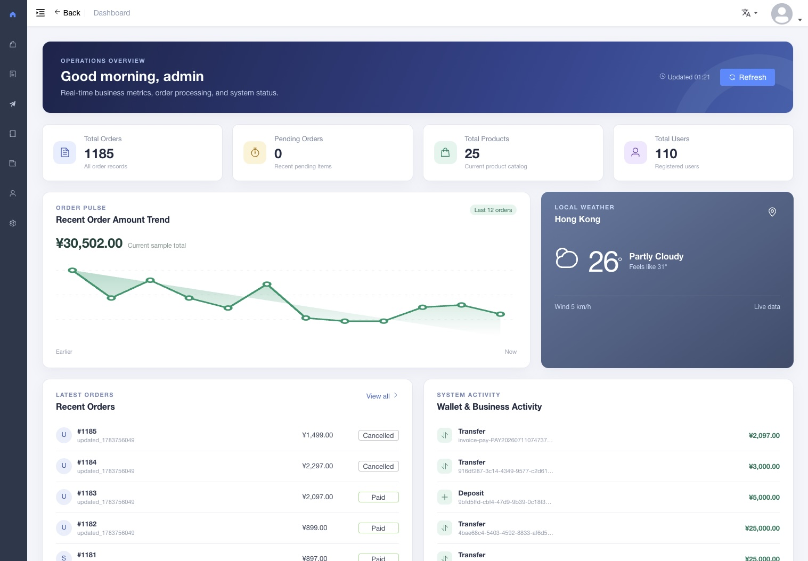
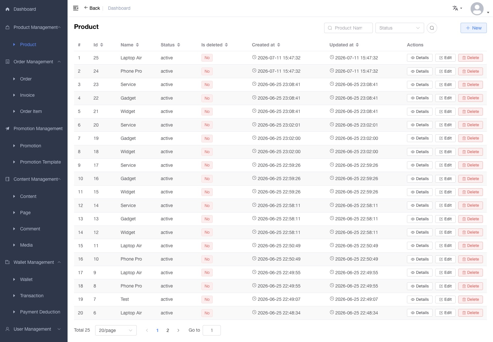
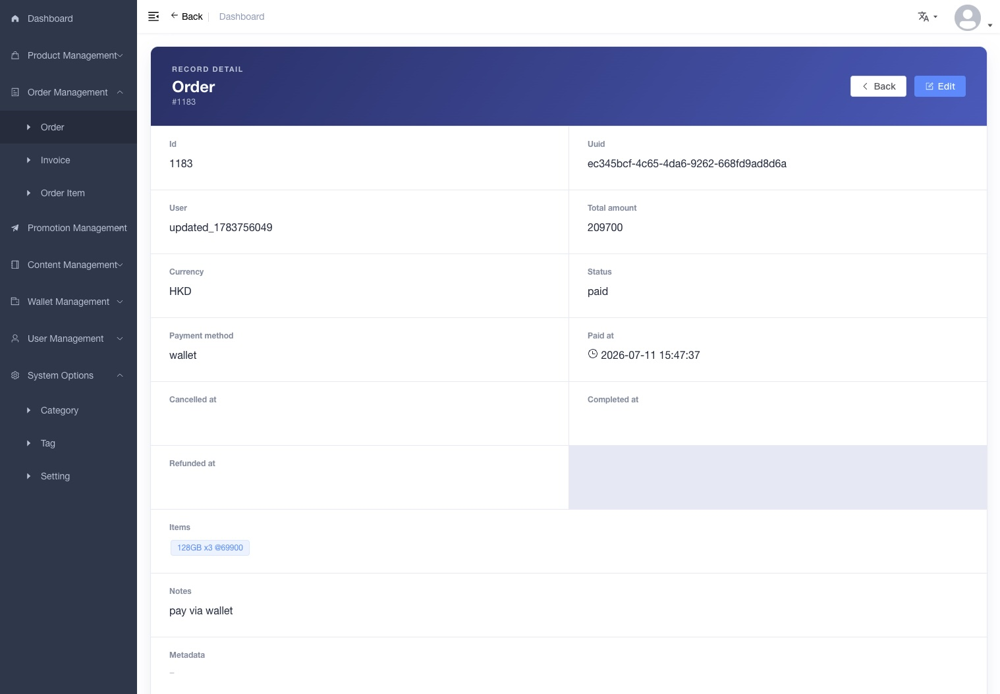
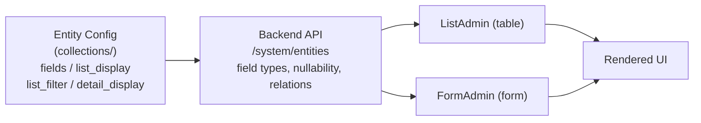

# crud-admin

<p align="center">
  <b>A configuration-driven admin panel powered by Vue 3, Element Plus and EasyAdmin</b>
  <br><br>
  
  
  
  
  <br><br>
</p>

> Chinese (Simplified): [README.zh-cn.md](README.zh-cn.md) · Chinese (Traditional): [README.zh-Hant.md](README.zh-Hant.md) · Japanese: [README.ja.md](README.ja.md)

> Backend: [crud-skeleton](https://github.com/immane/crud-skeleton) — Symfony 8.1 API with dynamic query engine and modular architecture

## Screenshots

<p align="center">
  
  
  
  <br>
  <em>Dashboard · List View · Record Detail</em>
</p>

## Table of Contents

- [Features](#features)
- [Tech Stack](#tech-stack)
- [Internationalization](#internationalization)
- [Project Structure](#project-structure)
- [Getting Started](#getting-started)
- [Configuration](#configuration)
- [EasyAdmin CRUD Engine](#easyadmin-crud-engine)
- [API Integration](#api-integration)
- [Documentation](#documentation)
- [Testing](#testing)
- [Deployment](#deployment)
- [License](#license)

## Features

- **Configuration-Driven CRUD Engine (EasyAdmin)** — Declare entities in config; get full list/form/detail/routes for free
- **21 Pluggable Form Fields** — input, textarea, select, boolean, integer, currency, date, datetime, image, file, JSON, JSON Schema, rich text, relation pickers, transfer, password (double-entry + strength hints), email (format validation), and more
- **Form Validation** — declarative `field.rules` / `field.validator` merged into `el-form`, with `registerFieldValidator` provide for plugins; blocks submit until valid
- **JSON Schema Forms** — render JSON objects as localized nested FormAdmin controls with Ajv validation; static or asynchronous schema providers
- **Detail View with Fallback Chain** — `detail/` → `list/` → plain text plugins per field type
- **Internationalization (i18n)** — English, Simplified Chinese, Traditional Chinese, Japanese; browser language detection; locale toggle in navbar; `Accept-Language` header and `_locale` param injected into API requests
- **JWT Authentication** — Bearer-token login with automatic refresh token rotation, port-isolated cookie persistence (`dream_studio_admin_token_{port}` avoids same-host cross-port conflict), and concurrent-request queuing
- **Role-Based Access Control** — Dynamic routes filtered by user roles via Vuex + Vue Router 4
- **Entity Introspection** — Queries backend `/system/entities` to infer field types, nullability, and relationships
- **Dynamic Filter & Sort** — Server-side filter expressions (`@filter`, `@sort`, `@order`) built from config-driven search UIs
- **Enterprise Dashboard** — Live order/product/user metrics, SVG sparkline chart, geolocation weather widget
- **Responsive Layout** — Collapsible sidebar with SVG icons, breadcrumb navigation, fixed header option
- **Code Splitting & Build Optimization** — Vite-powered chunk splitting with tree-shaking
- **Server Health Monitor** — navbar status dot polling `GET /health/live`, `/health/ready` and `/metrics`
- **Vitest Unit Testing** — 1041 tests across 78 spec files with 100% coverage thresholds on `src/components/EasyAdmin`
- **Tracked Lockfile** — `package-lock.json` is committed for reproducible installs


## Tech Stack

| Component | Technology |
|-----------|-----------|
| Framework | Vue 3.5 |
| UI Library | Element Plus 2.9 |
| State Mgmt | Vuex 4 |
| Routing | Vue Router 4 |
| HTTP | Axios |
| Build | Vite 5 |
| CSS | SCSS (Dart Sass) |
| Icons | @element-plus/icons-vue + SVG sprite |
| Testing | Vitest 2.1 |
| Types | TypeScript 6.0 |
| Backend | [crud-skeleton](https://github.com/immane/crud-skeleton) (Symfony 8.1) |

## Internationalization

The app detects the browser language on first load and persists the choice via `localStorage`. A dropdown in the navbar allows switching at any time — this clears the entity cache and reloads the page.

| Locale | Code | Element Plus | API Header |
|--------|------|-------------|------------|
| English (default) | `en` | en | `Accept-Language: en`, `_locale=en` |
| 中文 (简体) | `zh` | zh-cn | `Accept-Language: zh`, `_locale=zh` |
| 中文 (繁體) | `zh-Hant` | zh-tw | `Accept-Language: zh-Hant`, `_locale=zh-Hant` |
| 日本語 | `ja` | ja | `Accept-Language: ja`, `_locale=ja` |

Translation keys use the English string directly (flat format), e.g. `$t('New / Edit')`. Adding a new language requires only a new `src/i18n/{code}.js` file and an entry in the navbar dropdown.

## Project Structure

```text
.
├── src/
│   ├── main.js                      # App entry: createApp, install plugins, mount
│   ├── permission.js                # Navigation guard (auth + role check)
│   ├── components/EasyAdmin/        # ⭐ Core CRUD Engine
│   │   ├── FormAdmin.vue            # Dynamic form builder
│   │   ├── ListAdmin.vue            # Dynamic list/table builder
│   │   ├── DetailAdmin.vue          # Configurable record detail page
│   │   ├── SearchFilter.vue         # Dynamic filter UI
│   │   └── plugins/
│   │       ├── form/                # 21 field-type plugins
│   │       ├── list/                # 10 list-rendering plugins
│   │       └── detail/              # 2 detail-only plugins
│   ├── configs/                     # Declarative entity configs
│   │   ├── routes.js                # Menu / route definitions
│   │   ├── entities.js              # Auto-loader (import.meta.glob)
│   │   └── collections/             # Entity schemas (10 bundles: authorization, common, identity, inventory, payment, promotion, store, trade, wallet, wechat)
│   ├── i18n/                        # Locale files (en, zh, zh-Hant, ja)
│   │   └── index.js                 # i18n plugin + browser detection
│   ├── icons/                       # SVG sprite + legacy icon compat map
│   ├── layout/                      # Sidebar + Navbar + AppMain
│   ├── router/                      # Vue Router 4 + r()/g() generators
│   ├── store/                       # Vuex 4 (auto-loads modules/)
│   ├── styles/                      # Global SCSS (sidebar, transitions, overrides)
│   ├── utils/                       # auth.js, entity.ts, request.ts, etc.
│   └── views/                       # Page views
│       ├── admin/                   # Generic CRUD (list + form + detail)
│       ├── dashboard/               # Enterprise dashboard
│       └── login/                   # Login page
├── tests/unit/                      # 1041 Vitest tests (78 spec files)
├── docs/                            # Design contracts + AI context
│   └── ai/context.md                # AI assistant reference
├── vite.config.ts                   # Vite 5 + Vue 3 + JSX config
├── vitest.config.ts                 # Vitest configuration
├── tsconfig.json
└── package.json
```

## Getting Started

### Prerequisites

- **Node.js** >= 14.18
- **npm** >= 6.0.0

### 1) Clone

```bash
git clone https://github.com/immane/crud-admin.git
cd crud-admin
```

### 2) Install

```bash
npm install
```

### 3) Configure environment

Copy and edit the development environment file:

```bash
cp .env.example .env.development
```

Key variables:

```dotenv
VITE_BASE_API=
VITE_PROXY_TARGET=http://127.0.0.1:8000
VITE_API_PREFIX=/api/v1
VITE_AUTH_API_PREFIX=/api/auth
VITE_SYSTEM_API_PREFIX=/system
```

### 4) Run

```bash
npm run dev          # Development (localhost:9528, HMR)
npm run build        # Production build
npm run lint         # ESLint
npm run type-check   # TypeScript check
npm run test         # Vitest
```

## Configuration

### Environment Files

| File | Purpose |
|------|---------|
| `.env.development` | Dev server (no build output) |
| `.env.staging` | Staging build |
| `.env.production` | Production build |

### Environment Variables

| Variable | Description | Default |
|----------|-------------|---------|
| `VITE_BASE_API` | API base URL | `''` |
| `VITE_PROXY_TARGET` | Dev proxy target | — |
| `VITE_API_PREFIX` | Business API prefix | `/api/v1` |
| `VITE_AUTH_API_PREFIX` | Auth API prefix | `/api/auth` |
| `VITE_SYSTEM_API_PREFIX` | System API prefix | `/system` |
| `VITE_TINYMCE_SRC` | TinyMCE script source | `''` |

### Build Customization

`vite.config.ts` key settings:
- **base**: `/admin/` in production, `/` in development
- **Dev proxy**: `/api`, `/system`, `/health`, `/metrics`, `/upload`, `/uploads` proxied to `VITE_PROXY_TARGET`
- **Plugins**: `@vitejs/plugin-vue` + `@vitejs/plugin-vue-jsx`
- **Aliases**: `@` → `src/`
- **Define**: Injects `process.env.VITE_*` at compile time

## EasyAdmin CRUD Engine

EasyAdmin is the heart of this project — a configuration-driven engine that **auto-generates CRUD interfaces** from declarative entity definitions.



### Step 1 — Define an Entity Config

In `src/configs/collections/common/Content.js`:

```js
import { t } from '@/i18n'

export default {
  Content: {
    form: {
      fields: [
        'title',
        { property: 'category', required: false },
        { property: 'tags', required: false }
      ]
    },
    list: {
      query: { '@order': 'entity.id|DESC' },
      list_filter: {
        title: t('Title'),
        'category.id': () => axios
          .get('/api/v1/manage/categories')
          .then(res => Object.assign({ __label: t('Category') }, ...res.data.map(v => ({ [v.id]: v.name }))))
      },
      list_display: ['id', 'title', 'category', 'tags', 'createdAt']
    },
    detail: {
      detail_display: ['id', 'title', 'category', 'tags', 'body', 'createdAt']
    }
  }
}
```

### Step 2 — Register Routes

In `src/configs/routes.js`:

```js
import { r } from '@/router/generator'
import { t } from '@/i18n'
{
  path: '/content', component: Layout,
  meta: { title: t('Content Management'), icon: 'el-icon-notebook' },
  children: [...r('Content', t('Content'))]
}
```

**That's it** — you have fully functional list, form, and detail pages, automatically translated.

### Field Type Plugins

EasyAdmin ships with 21 field type plugins, auto-resolved from entity metadata:

| Plugin | Type | Description |
|--------|------|-------------|
| `input.vue` | string (default) | Text input |
| `textarea.vue` | text | Multi-line textarea |
| `text.vue` | — | TinyMCE rich text editor |
| `boolean.vue` | boolean | Checkbox |
| `integer.vue` | integer | Number input |
| `currency.vue` | currency | Number input with currency code (yuan input, cents storage) |
| `select.vue` | — | Dropdown selector |
| `date.vue` | date | Date picker |
| `datetime.vue` | datetime | DateTime picker |
| `image.vue` | image | Image upload/preview |
| `file.vue` | — | File upload |
| `json.vue` | — | JSON editor (code/tree view) |
| `json_schema.vue` | `json_schema` | JSON Schema-generated nested form with Ajv validation |
| `json-custom.vue` | — | Nested sub-object editor |
| `array.vue` | array | Array editor (select or nested form) |
| `RelationToOne.vue` | ManyToOne, OneToOne | Relation picker with remote search |
| `RelationToMany.vue` | ManyToMany, OneToMany | Multi-relation picker |
| `transfer.vue` | — | Shuttle/transfer component |
| `code.vue` | — | Code textarea |
| `password.vue` | — | Password with show/hide, double-entry when masked, 6-char + letter+number + match hints, blocks submit |
| `email.vue` | — | Email with live format hint, blocks submit on invalid |

### Field Configuration Reference

```ts
interface FieldOption {
  property: string           // Entity property name (required)
  label?: string             // Override display label
  type?: string              // Force field type
  required?: boolean         // Override nullable metadata
  editable?: boolean         // Inline editable in list view
  tab?: string               // Group into a named tab
  default_value?: unknown    // Default value for create mode
  field_options?: object     // Props passed to el-form-item
  field_events?: object      // Events bound to el-form-item
  type_options?: object      // Props passed to the field plugin
  type_events?: object       // Events bound to the field plugin
  hidden?: boolean | string[]            // true/false or ['create']/['update']/['create','update'] (also 'edit' alias)
  relation_filter?: object   // Filter for relation queries
  component?: object         // Custom component (JSX render function)
  help?: string              // Help text below the field
  full_width?: boolean       // Span full grid width (detail view)
}
```

### JSON Schema Forms

Use `json_schema` to edit a known JSON object through generated form controls instead of
the raw JSON editor. Store a static schema beside the entity config, as with
`src/configs/collections/store/StoreAddress.json` and `StoreContact.json`.

```js
import StoreAddressSchema from './StoreAddress.json'

{
  property: 'address',
  type: 'json_schema',
  required: false,
  type_options: { schema: StoreAddressSchema }
}
```

The schema may also be an async provider receiving `{ entity, id, property, form }`,
which reserves the same interface for backend-generated schemas. Schema labels,
descriptions, and enum labels are passed through `t()`. Ajv validates the complete JSON
object on submit; optional blank values are ignored, required values are enforced, and
`null`/`undefined` object properties are omitted from the request payload. See the
[Config Reference Manual](docs/manual/config-reference.md#json-schema-forms) for supported
keywords and fallback behavior. Reuse the same field definition in `detail.detail_display`
to render a schema-ordered label/value view on record detail pages.

### Form Validation

FormAdmin merges `field.rules` / `field.validator` into `el-form` rules. Plugins can also call `inject('registerFieldValidator')` (provided by FormAdmin) to register validators that block `onSubmit`. Example:

```js
// User.js
{
  property: 'plainPassword',
  type: 'password', // double-entry when masked, strength hints, blocks submit until 6+ chars + letter + number
  help: t('User password help')
},
{ property: 'email', type: 'email' } // live hint + invalid-format blocking
```

Built-in validators live in `src/utils/validate.js` (`isPasswordCompliant`, `createPasswordValidator`, `isEmailValid`, `createEmailValidator`) and are used by the password/email plugins.

### Route Generators

| Function | Behavior |
|----------|----------|
| `r(entity, title)` | Redirect routes — reuses `admin/list.vue`, `admin/form.vue`, `admin/detail.vue` (recommended) |
| `g(entity, title)` | Direct routes — expects custom view files per entity (reserved alternative) |

> `r()` handles virtually all CRUD scenarios including nested sub-forms, JSX custom components,
> relation search, detail fallback chains, and async filter functions. `g()` is kept as a backup
> approach for cases where a fully independent page is warranted, but it is rarely needed in practice.

## API Integration

### Axios Instance (`src/utils/request.ts`)

- **Base URL**: `VITE_BASE_API` from environment
- **Timeout**: 30 seconds
- **Request Interceptor**: Injects `Authorization: Bearer <token>` header, `Accept-Language` header and `_locale` query parameter
- **Response Interceptor**: Auto-refreshes token on 401; queues concurrent failed requests behind a single refresh

### API Response Format

```json
{
  "code": 0,
  "message": "SUCCESS",
  "data": {},
  "paginator": { "totalCount": 42 }
}
```

### Expected Backend Endpoints

| Endpoint | Method | Description |
|----------|--------|-------------|
| `/api/auth/login` | POST | User authentication |
| `/api/auth/token/refresh` | POST | Rotate refresh token |
| `/api/auth/logout` | POST | Invalidate refresh token |
| `/api/v1/app/users/me` | GET | Current user + roles |
| `/system/entities` | GET | List all entity class names |
| `/system/entities/{entity}` | GET | Entity field metadata |
| `/api/v1/manage/{entity}` | GET/POST | Entity list / create |
| `/api/v1/manage/{entity}/{id}` | GET/PUT/DELETE | Entity detail / update / delete |

## Documentation

- **[Architecture Design](docs/design/architecture.md)** — System layers, bootstrap flow, auth flow, routing, state management
- **[Code & API Contracts](docs/design/contracts.md)** — Request/response formats, component props contract
- **[EasyAdmin Design](docs/design/easyadmin-design.md)** — Plugin system, data flow, extension points
- **[EasyAdmin Config Contract](docs/design/easyadmin-config-contract.md)** — Complete config schema reference
- **[Config Reference Manual](docs/manual/config-reference.md)** — Complete EasyAdmin config guide, from simple to advanced
- **[AI Context](docs/ai/context.md)** — Quick reference for AI-assisted development
- **[Vue 3 Migration Plan](docs/plan/vue3-tsx-vite-migration.md)** — Migration notes and current status

## Testing

**1041 tests across 78 spec files · Vitest 2.1 · 100% statements/branches/lines thresholds on `src/components/EasyAdmin`**

```bash
npm run test              # Run all tests (watch mode off in CI)
npm run test:related      # Run tests related to changed files
npm run test:coverage     # Run with coverage report
npm run type-check        # TypeScript check
npm run test:ci           # CI (type-check + test)
```

Tests organized in `tests/unit/`:
- **Component tests**: Breadcrumb, Hamburger, SvgIcon, EasyAdmin feedback UI
- **Utility tests**: `request.ts`, `validate.js`, `entity.ts`, `formatTime`, `parseTime`, `param2Obj`

Configuration: `vitest.config.ts` (jsdom environment, Vue 3 plugin; 100% statements/branches/lines thresholds enforced on `src/components/EasyAdmin`).

CI: GitHub Actions runs type-check plus sharded unit tests and a coverage job. Docs/config/i18n-only changes are path-filtered so CI jobs are skipped.

## Deployment

### Build Output

```
dist/
├── static/
│   ├── css/
│   ├── js/
│   └── img/
├── favicon.ico
└── index.html
```

### Deployment Notes

1. Set `VITE_BASE_API` in `.env.production` to your API server URL
2. Run `npm run build`
3. Deploy `dist/` to your web server
4. Configure client-side routing — redirect all paths to `index.html`:
   - **Nginx**: `try_files $uri $uri/ /admin/index.html;`
   - **Apache**: Use `.htaccess` with mod_rewrite

## License

MIT

## Acknowledgments

This project is based on the excellent work of:

- [vue-admin-template](https://github.com/PanJiaChen/vue-admin-template) — the Vue 2 base (no longer actively maintained)
- [Element UI](https://element.eleme.io/) — the original UI component library
