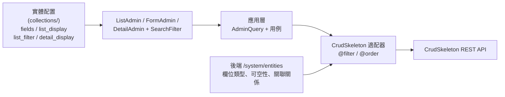

# crud-admin

<p align="center">
  <b>基於 Vue 3、Element Plus 和 EasyAdmin 的配置驅動後台管理系統</b>
  <br><br>
  
  
  
  
  <br><br>
</p>

> English: [README.md](README.md) · 简体中文: [README.zh-cn.md](README.zh-cn.md) · 日本語: [README.ja.md](README.ja.md)

> 後端： [crud-skeleton](https://github.com/immane/crud-skeleton) — 基於 Symfony 8.1 的 API，含動態查詢引擎和模組化架構

## 介面展示

<p align="center">
  
  
  
  <br>
  <em>儀表板 · 列表視圖 · 記錄詳情</em>
</p>

## 目錄

- [功能特色](#功能特色)
- [技術棧](#技術棧)
- [國際化](#國際化)
- [專案結構](#專案結構)
- [快速開始](#快速開始)
- [配置](#配置)
- [EasyAdmin CRUD 引擎](#easyadmin-crud-引擎)
- [API 整合](#api-整合)
- [文件](#文件)
- [測試](#測試)
- [部署](#部署)
- [授權](#授權)
- [致謝](#致謝)

## 功能特色

- **配置驅動 CRUD 引擎（EasyAdmin）** — 在配置中宣告實體，即可自動獲得完整的列表/表單/詳情/路由
- **21 種即插即用表單欄位** — input、textarea、select、boolean、integer、currency、date、datetime、image、file、JSON、JSON Schema、富文字、關聯選擇器、transfer、password（雙輸入＋強度提示）、email（格式校驗）等
- **表單校驗** — 宣告式 `field.rules` / `field.validator` 合併至 `el-form`，外掛可透過 `registerFieldValidator` 注入校驗；未通過時阻斷提交
- **JSON Schema 表單** — 將 JSON 物件渲染為已國際化的巢狀 FormAdmin 控制項，並使用 Ajv 校驗；支援靜態或非同步 Schema 提供者
- **帶降級鏈的詳情視圖** — 依欄位類型按 `detail/` → `list/` → 純文字外掛逐級降級
- **國際化（i18n）** — 英文、簡體中文、繁體中文、日文；瀏覽器語言自動偵測；導覽列語言切換器；`Accept-Language` 請求標頭和 `_locale` 參數自動注入 API 請求
- **JWT 驗證** — Bearer token 登入，自動刷新 token 輪換，按埠隔離的 Cookie 持久化（`dream_studio_admin_token_{port}` 避免同主機跨埠衝突），並發請求排隊
- **基於角色的存取控制** — 透過 Vuex + Vue Router 4 按使用者角色過濾動態路由
- **實體自省** — 查詢後端 `/system/entities` 推斷欄位類型、可空性和關聯關係
- **動態篩選與排序** — 基於配置驅動的搜尋 UI 組裝伺服器端篩選表達式（`@filter`、`@order`）
- **企業儀表板** — 即時訂單/商品/使用者指標、SVG sparkline 圖表、地理定位天氣元件
- **響應式佈局** — 可折疊側邊欄（SVG 圖示）、麵包屑導覽、可選固定頂欄
- **程式碼分割與建置最佳化** — Vite 驅動的 chunk 分割與 tree-shaking
- **伺服器健康監控** — 導覽列狀態燈輪詢 `GET /health/live`、`/health/ready` 與 `/metrics`
- **Vitest 單元測試** — 101 個 spec 檔案共 1330 項測試，`src/easyadmin/{ui/vue,core,application,adapters/crudskeleton}` 強制 100% 覆蓋率門檻
- **受控的 Lockfile** — 提交 `package-lock.json`，確保依賴安裝可重現


## 技術棧

| 元件 | 技術 |
|-----------|-----------|
| 框架 | Vue 3.5 |
| UI 庫 | Element Plus 2.9 |
| 狀態管理 | Vuex 4 |
| 路由 | Vue Router 4 |
| HTTP | Axios |
| 建置 | Vite 5 |
| CSS | SCSS (Dart Sass) |
| 圖示 | @element-plus/icons-vue + SVG sprite |
| 測試 | Vitest 2.1 |
| 類型 | TypeScript 6.0 |
| 後端 | [crud-skeleton](https://github.com/immane/crud-skeleton) (Symfony 8.1) |

## 國際化

系統首次載入時偵測瀏覽器語言，並透過 `localStorage` 持久化選擇。導覽列中的下拉選單可隨時切換語言——切換時會清除實體快取並重新整理頁面。

| 語言 | 代碼 | Element Plus | API Header |
|--------|------|-------------|------------|
| English（預設） | `en` | en | `Accept-Language: en`, `_locale=en` |
| 中文 (簡體) | `zh` | zh-cn | `Accept-Language: zh`, `_locale=zh` |
| 中文 (繁體) | `zh-Hant` | zh-tw | `Accept-Language: zh-Hant`, `_locale=zh-Hant` |
| 日本語 | `ja` | ja | `Accept-Language: ja`, `_locale=ja` |

翻譯鍵直接使用英文字串（扁平格式），如 `$t('New / Edit')`。新增語言只需新建 `src/i18n/{code}.js` 檔案並在導覽列下拉選單中增加一項。

## 專案結構

```text
.
├── src/
│   ├── main.js                      # 應用入口：createApp、安裝外掛、掛載
│   ├── App.vue                      # 根組件（<router-view />）
│   ├── permission.js                # 路由守衛（驗證＋角色檢查）
│   ├── settings.js                  # 應用標題、佈局選項
│   ├── config.js                    # 宣告式配置再匯出
│   ├── api/                         # 接口定義（prefix、user/auth）
│   ├── assets/                      # 靜態圖片（登入背景、404）
│   ├── components/                  # 通用 UI（Breadcrumb、Hamburger、SvgIcon、Tinymce）
│   ├── easyadmin/                   # ⭐ 配置驅動 CRUD 引擎
│   │   ├── core/query/              # 純查詢模型（AdminQuery、FilterNode、排序、分頁、DQL 工具）
│   │   ├── core/model/              # 實體標識、記錄、欄位配置、管理元數據
│   │   ├── core/ports/              # 倉儲、元數據、編譯器接口
│   │   ├── application/query/       # AdminQuery 構建＋URL 查詢同步
│   │   ├── application/usecases/    # 保存、刪除、批量、匯出、關聯、分批欄位工具
│   │   ├── adapters/crudskeleton/   # 適配器、元數據提供器、CSQE 查詢編譯器
│   │   ├── adapters/graphql/        # 預留佔位（暫無後端契約）
│   │   └── ui/vue/                  # Vue UI：List/Form/Detail/SearchFilter＋外掛
│   │       ├── FormAdmin.vue        # 動態表單生成器
│   │       ├── ListAdmin.vue        # 動態列表/表格生成器
│   │       ├── DetailAdmin.vue      # 可配置記錄詳情頁
│   │       ├── SearchFilter.vue     # 動態篩選 UI
│   │       ├── feedback.ts          # Element Plus 訊息/載入工具
│   │       └── plugins/
│   │           ├── form/            # 21 個欄位類型外掛
│   │           ├── list/            # 10 個列表渲染外掛
│   │           └── detail/          # 3 個詳情專用外掛
│   ├── configs/                     # 宣告式實體配置
│   │   ├── routes.js                # 選單／路由定義
│   │   ├── entities.js              # 自動載入器（import.meta.glob）
│   │   └── collections/             # 實體 Schema（10 個 bundles：authorization、common、identity、inventory、payment、promotion、store、trade、wallet、wechat）
│   ├── i18n/                        # 語言檔案（en、zh、zh-Hant、ja）
│   │   └── index.js                 # i18n 外掛＋瀏覽器語言偵測
│   ├── icons/                       # SVG 雪碧圖＋舊圖示相容對應
│   ├── layout/                      # 側邊欄＋導覽列＋主內容區
│   ├── router/                      # Vue Router 4 + r()/g() 生成器
│   ├── store/                       # Vuex 4（自動載入 modules/）
│   ├── styles/                      # 全域 SCSS（側邊欄、過渡、覆寫）
│   ├── types/                       # TypeScript 定義（admin、api）
│   ├── utils/                       # auth.js、request.ts 等
│   └── views/                       # 頁面視圖
│       ├── admin/                   # 通用 CRUD（list + form + detail）
│       ├── dashboard/               # 企業儀表板
│       └── login/                   # 登入頁
├── tests/unit/                      # 1330 項 Vitest 測試（101 個 spec 檔案）
│   ├── components/                  # 組件＋外掛測試
│   ├── easyadmin/                   # core/application/adapter/golden/config 測試
│   └── store/、router/、utils/      # Store、路由、工具函數測試
├── docs/                            # design/、manual/、plan/、tasks/、ai/context.md
├── mock/                            # 歷史遺留開發 API 模擬（未接入 Vite 建置）
├── public/                          # favicon.ico、.htaccess
├── index.html                       # Vite 入口 HTML
├── .env.development/.staging/.production
├── vite.config.ts                   # Vite 5 + Vue 3 + JSX 配置
├── vitest.config.ts                 # Vitest 配置（easyadmin 路徑 100% 閾值）
├── tsconfig.json
└── package.json
```

## 快速開始

### 前置要求

- **Node.js** >= 18.0
- **npm** >= 9.0.0

### 1) 複製

```bash
git clone https://github.com/immane/crud-admin.git
cd crud-admin
```

### 2) 安裝

```bash
npm install
```

### 3) 配置環境變數

編輯開發環境檔案（`.env.development` 已提交本地預設值，不提供 `.env.example`）：

```bash
# .env.development — 將代理指向你的後端
VITE_PROXY_TARGET=http://127.0.0.1:8000
```

關鍵變數：

```dotenv
VITE_BASE_API=
VITE_PROXY_TARGET=http://127.0.0.1:8000
VITE_API_PREFIX=/api/v1
VITE_AUTH_API_PREFIX=/api/auth
VITE_SYSTEM_API_PREFIX=/system
MEDIA_STORAGE_DEFAULT=local
```

### 4) 執行

```bash
npm run dev          # 開發（localhost:9528，熱更新）
npm run build        # 生產建置
npm run lint         # ESLint
npm run type-check   # TypeScript 類型檢查
npm run test         # Vitest
```

## 配置

### 環境檔案

| 檔案 | 用途 |
|------|---------|
| `.env.development` | 開發伺服器（無建置產物） |
| `.env.staging` | 預發布建置 |
| `.env.production` | 生產建置 |

### 環境變數

| 變數 | 描述 | 預設值 |
|----------|-------------|---------|
| `VITE_BASE_API` | API 基礎 URL | `''` |
| `VITE_PROXY_TARGET` | 開發代理目標 | — |
| `VITE_API_PREFIX` | 業務 API 前綴 | `/api/v1` |
| `VITE_AUTH_API_PREFIX` | 驗證 API 前綴 | `/api/auth` |
| `VITE_SYSTEM_API_PREFIX` | 系統 API 前綴 | `/system` |
| `VITE_TINYMCE_SRC` | TinyMCE 腳本源 | `''` |
| `MEDIA_STORAGE_DEFAULT` | 預設上傳儲存驅動（`local` / `qiniu`） | `local` |

### 建置自訂配置

`vite.config.ts` 關鍵設定：
- **base**：生產環境 `/admin/`，開發環境 `/`
- **開發代理**：`/api`、`/system`、`/health`、`/metrics`、`/upload`、`/uploads` 代理至 `VITE_PROXY_TARGET`
- **外掛**：`@vitejs/plugin-vue` + `@vitejs/plugin-vue-jsx`
- **別名**：`@` → `src/`
- **Define**：編譯時注入 `process.env.VITE_*`

## EasyAdmin CRUD 引擎

EasyAdmin 是本專案的核心——一個**配置驅動引擎**，能夠根據宣告式實體定義**自動生成 CRUD 介面**。



### 第一步 — 定義實體配置

在 `src/configs/collections/common/Content.js` 中：

```js
import { t } from '@/i18n'
import axios from '@/utils/request'
import { API_PREFIX, apiPath } from '@/api/prefix'
import { orderByIdDesc } from '../helpers'

export default {
  Content: {
    form: {
      fields: [
        'title',
        { property: 'body', required: true },
        { property: 'category', required: false, tab: `${t('Metadata')}` },
        { property: 'tags', required: false, tab: `${t('Metadata')}` }
      ],
      batch_edit: {
        fields: ['category', 'tags']
      }
    },
    list: {
      query: orderByIdDesc,
      list_filter: {
        title: t('Title'),
        'category.id': () => axios
          .get(apiPath(API_PREFIX, 'manage/categories'))
          .then(res => Object.assign({ __label: t('Category') }, ...res.data.map(v => ({ [v.id]: v.name }))))
      },
      list_display: ['id', 'title', 'category', 'tags', 'createdAt', 'updatedAt']
    },
    detail: {
      detail_display: '__all__'
    }
  }
}
```

### 第二步 — 註冊路由

在 `src/configs/routes.js` 中：

```js
import { r } from '@/router/generator'
import { t } from '@/i18n'
{
  path: '/content', component: Layout,
  meta: { title: t('Content Management'), icon: 'el-icon-notebook' },
  children: [...r('Content', t('Content'))]
}
```

**僅此而已** — 你已擁有自動翻譯的完整列表頁、表單頁和詳情頁。

### 欄位類型外掛

EasyAdmin 內建 21 種欄位類型外掛，根據實體元資料自動解析：

| 外掛 | 類型 | 描述 |
|--------|------|-------------|
| `input.vue` | string（預設） | 文字輸入框 |
| `textarea.vue` | text | 多行文字域 |
| `text.vue` | — | TinyMCE 富文字編輯器 |
| `boolean.vue` | boolean | 核取方塊 |
| `integer.vue` | integer | 數字輸入框 |
| `currency.vue` | currency | 含幣別的數字輸入（元輸入、分儲存） |
| `select.vue` | — | 下拉選擇器 |
| `date.vue` | date | 日期選擇器 |
| `datetime.vue` | datetime | 日期時間選擇器 |
| `image.vue` | image | 圖片上傳/預覽 |
| `file.vue` | — | 檔案上傳 |
| `json.vue` | — | JSON 編輯器（程式碼/樹視圖） |
| `json_schema.vue` | `json_schema` | 由 JSON Schema 生成的巢狀表單，使用 Ajv 校驗 |
| `json-custom.vue` | — | 巢狀子物件編輯器 |
| `array.vue` | array | 陣列編輯器（選擇器或巢狀表單） |
| `RelationToOne.vue` | ManyToOne、OneToOne | 單一關聯選擇器（含遠端搜尋） |
| `RelationToMany.vue` | ManyToMany、OneToMany | 多重關聯選擇器 |
| `transfer.vue` | — | 穿梭框元件 |
| `code.vue` | — | 程式碼文字域 |
| `password.vue` | — | 密碼（含顯示/隱藏切換，遮蔽時雙輸入，6 位＋字母＋數字＋一致性提示，校驗不通過阻斷提交） |
| `email.vue` | — | 信箱（即時格式提示，格式非法時阻斷提交） |

### 欄位配置參考

```ts
interface FieldOption {
  property: string           // 實體屬性名稱（必填）
  label?: string             // 覆寫顯示標籤
  type?: string              // 強制指定欄位類型
  required?: boolean         // 覆寫可空性元資料
  editable?: boolean         // 列表視圖中可內聯編輯
  tab?: string               // 分組到指定命名頁籤
  default_value?: unknown    // 新增模式下的預設值
  field_options?: object     // 傳遞給 el-form-item 的 Props
  field_events?: object      // 綁定到 el-form-item 的事件
  type_options?: object      // 傳遞給欄位外掛的 Props
  type_events?: object       // 綁定到欄位外掛的事件
  hidden?: boolean | string[]            // true/false 或 ['create']/['update']/['create','update']（亦支援 'edit' 別名）
  relation_filter?: object   // 關聯查詢的篩選條件
  relation?: object         // 關聯目標覆寫（entity、valueKey、cardinality）
  component?: object         // 自訂元件（JSX 渲染函數）
  help?: string              // 欄位下方說明文字
  full_width?: boolean       // 詳情視圖中跨滿網格寬度
}
```

### JSON Schema 表單

當 JSON 物件有確定的資料契約時，使用 `json_schema` 生成一般表單控制項，而不是使用原始 JSON 編輯器。靜態 Schema 應與實體配置放在同一目錄，例如
`src/configs/collections/store/StoreAddress.json` 與 `StoreContact.json`。

```js
import StoreAddressSchema from './StoreAddress.json'

{
  property: 'address',
  type: 'json_schema',
  required: false,
  type_options: { schema: StoreAddressSchema }
}
```

`schema` 也可以是接收 `{ entity, id, property, form }` 的非同步函數，為後端生成的 Schema 預留相同介面。Schema 的標籤、描述和列舉標籤會自動經過 `t()`；Ajv 會在提交時校驗完整物件。可選空值不會參與校驗，必填項仍會校驗，巢狀物件中的 `null` / `undefined` 不會傳入請求。將相同欄位定義放入 `detail.detail_display`，即可在詳情頁按 Schema 順序顯示標籤和值。支援的關鍵字與複雜 Schema 的降級策略見[配置參考手冊](docs/manual/config-reference.zh-Hant.md)。

### 表單校驗

FormAdmin 會將 `field.rules` / `field.validator` 合併至 `el-form` 規則。外掛亦可呼叫 FormAdmin 提供的 `inject('registerFieldValidator')` 註冊校驗器，未通過時阻斷 `onSubmit`。範例：

```js
// User.js
{
  property: 'plainPassword',
  type: 'password', // 遮蔽時雙輸入、強度提示，6 位＋字母＋數字校驗通過前阻斷提交
  help: t('User password help')
},
{ property: 'email', type: 'email' } // 即時提示＋格式非法時阻斷
```

內建校驗位於 `src/utils/validate.js`（`isPasswordCompliant`、`createPasswordValidator`、`isEmailValid`、`createEmailValidator`），由 password/email 外掛使用。

### 路由生成器

| 函數 | 行為 |
|----------|----------|
| `r(entity, title)` | 重定向路由 — 複用 `admin/list.vue`、`admin/form.vue`、`admin/detail.vue`（推薦） |
| `g(entity, title)` | 直接路由 — 期望每個實體有獨立的視圖檔案（預留備選方案） |

> `r()` 已可滿足幾乎所有 CRUD 場景，包括巢狀子表單、JSX 自訂元件、關聯搜尋、詳情降級鏈和非同步篩選函數。`g()` 保留為備選方案，用於需要完全獨立頁面的情況，但實務上很少需要。

## API 整合

### Axios 實例（`src/utils/request.ts`）

- **Base URL**：來自環境變數的 `VITE_BASE_API`
- **逾時時間**：30 秒
- **請求攔截器**：注入 `Authorization: Bearer <token>` 請求標頭、`Accept-Language` 請求標頭和 `_locale` 查詢參數
- **回應攔截器**：遇到 401 自動刷新 token；將並發失敗的請求排隊到單次刷新之後

### API 回應格式

```json
{
  "code": 0,
  "message": "SUCCESS",
  "data": {},
  "paginator": { "totalCount": 42 }
}
```

### 期望的後端端點

| 端點 | 方法 | 描述 |
|----------|--------|-------------|
| `/api/auth/login` | POST | 使用者驗證 |
| `/api/auth/token/refresh` | POST | 輪換 refresh token |
| `/api/auth/logout` | POST | 作廢 refresh token |
| `/api/v1/app/users/me` | GET | 目前使用者＋角色 |
| `/system/entities` | GET | 列出所有實體類別名稱 |
| `/system/entities/{entity}` | GET | 實體欄位元資料 |
| `/api/v1/manage/{entity}` | GET/POST | 實體列表／新增 |
| `/api/v1/manage/{entity}/{id}` | GET/PUT/DELETE | 實體詳情／更新／刪除 |

## 文件

- **[架構設計](docs/design/architecture.md)** — 系統分層、啟動流程、驗證流程、路由、狀態管理
- **[程式碼與 API 契約](docs/design/contracts.md)** — 請求/回應格式、元件 Props 契約
- **[EasyAdmin 設計](docs/design/easyadmin-design.md)** — 外掛系統、資料流、擴充點
- **[EasyAdmin 配置契約](docs/design/easyadmin-config-contract.md)** — 完整配置 Schema 參考
- **[配置參考手冊](docs/manual/config-reference.md)** — EasyAdmin 配置完整指南，從入門到進階
- **[AI 上下文](docs/ai/context.md)** — 面向 AI 輔助開發的快速參考
- **[EasyAdmin 查詢適配器計畫](docs/plan/easyadmin-query-adapter-architecture.md)** — 分層查詢/編譯器/適配器架構與遷移階段
- **[Vue 3 遷移計畫](docs/plan/vue3-tsx-vite-migration.md)** — 遷移說明及目前狀態

## 測試

**101 個 spec 檔案共 1330 項測試 · Vitest 2.1 · `src/easyadmin/{ui/vue,core,application,adapters/crudskeleton}` 強制 100% statements/branches/lines 門檻**

```bash
npm run test              # 執行全部測試（CI 中關閉 watch 模式）
npm run test:related      # 僅執行與變更檔案相關的測試
npm run test:coverage     # 產生覆蓋率報告
npm run type-check        # TypeScript 類型檢查
npm run test:ci           # CI（類型檢查＋測試）
```

測試位於 `tests/unit/`：
- **元件測試**：Breadcrumb、Hamburger、SvgIcon、EasyAdmin 回饋 UI
- **工具函數測試**：`request.ts`、`validate.js`、`formatTime`、`parseTime`、`param2Obj`，以及 EasyAdmin 查詢 core/adapter golden 測試

配置：`vitest.config.ts`（jsdom 環境、Vue 3 外掛；`src/easyadmin/{ui/vue,core,application,adapters/crudskeleton}` 強制 100% statements/branches/lines 門檻）。

CI：GitHub Actions 執行類型檢查＋分片單元測試與覆蓋率任務。僅文件/配置/i18n 變更時透過路徑過濾跳過 CI 任務。

## 部署

### 建置產物

```
dist/
├── index.html
├── favicon.ico
└── static/
    ├── index-[hash].js
    ├── index-[hash].css
    └── ...（帶內容雜湊的圖片與字體檔案）
```

### 部署說明

1. 在 `.env.production` 中將 `VITE_BASE_API` 設為你的 API 伺服器位址
2. 執行 `npm run build`
3. 將 `dist/` 目錄部署到你的 Web 伺服器
4. 配置客戶端路由 — 將所有路徑重定向至 `index.html`：
   - **Nginx**：`try_files $uri $uri/ /admin/index.html;`
   - **Apache**：使用 `.htaccess` + mod_rewrite

## 授權

MIT

## 致謝

本專案基於以下優秀專案構建：

- [vue-admin-template](https://github.com/PanJiaChen/vue-admin-template) — Vue 2 基礎模板（已停止維護）
- [Element UI](https://element.eleme.io/) — 原始 UI 元件庫
