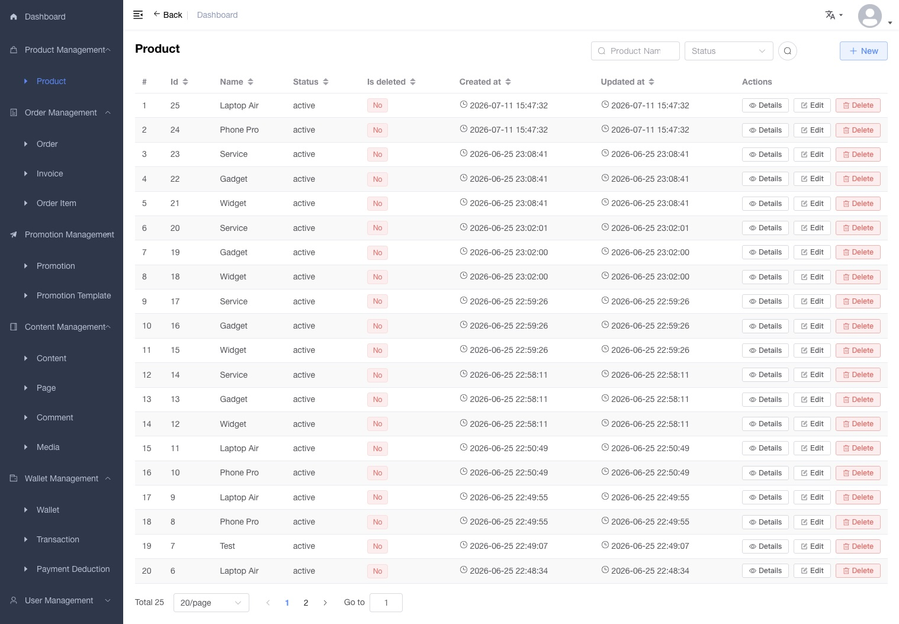
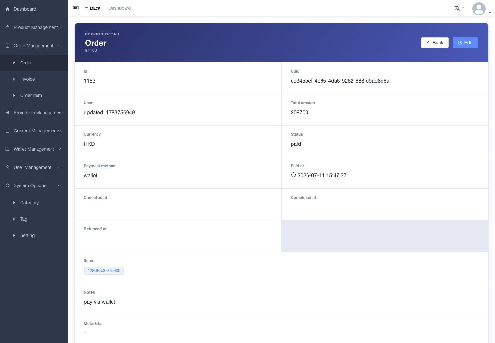

# crud-admin

<p align="center">
  <b>基于 Vue 3、Element Plus 和 EasyAdmin 的配置驱动后台管理系统</b>
  <br><br>
  
  
  
  
  <br><br>
</p>

> English: [README.md](README.md) · 繁體中文: [README.zh-Hant.md](README.zh-Hant.md) · 日本語: [README.ja.md](README.ja.md)

> 后端： [crud-skeleton](https://github.com/immane/crud-skeleton) — 基于 Symfony 8.1 的 API，含动态查询引擎和模块化架构

## 界面展示

<p align="center">
  
  
  
  <br>
  <em>控制台 · 列表视图 · 记录详情</em>
</p>

## 目录

- [功能特色](#功能特色)
- [技术栈](#技术栈)
- [国际化](#国际化)
- [项目结构](#项目结构)
- [快速开始](#快速开始)
- [配置](#配置)
- [EasyAdmin CRUD 引擎](#easyadmin-crud-引擎)
- [API 集成](#api-集成)
- [文档](#文档)
- [测试](#测试)
- [部署](#部署)
- [许可证](#许可证)

## 功能特色

- **配置驱动 CRUD 引擎（EasyAdmin）** — 在配置中声明实体，即可自动获得完整的列表/表单/详情/路由
- **17+ 种即插即用表单字段** — 文本输入、文本域、下拉选择、开关、数字、日期、图片、文件、JSON、富文本、关联选择器、穿梭框等
- **带降级链的详情视图** — `detail/` → `list/` → 纯文本插件逐字段类型降级
- **国际化（i18n）** — 英文、简体中文、繁体中文、日文；浏览器语言自动检测；导航栏语言切换器；`Accept-Language` 请求头和 `_locale` 参数自动注入 API 请求
- **JWT 认证** — Bearer token 登录，自动刷新 token 轮换，Cookie 持久化，并发请求排队
- **基于角色的权限控制** — 通过 Vuex + Vue Router 4 按用户角色过滤动态路由
- **实体自省** — 查询后端 `/system/entities` 自动推断字段类型、可空性和关联关系
- **动态筛选与排序** — 基于配置驱动的搜索 UI 生成服务端筛选表达式（`@filter`、`@sort`、`@order`）
- **企业控制台** — 实时订单/商品/用户指标、SVG 折线图、浏览器定位天气组件
- **响应式布局** — 可折叠侧边栏（SVG 图标）、面包屑导航、可选固定顶栏
- **代码分割与构建优化** — Vite 驱动的 chunk 分割和 tree-shaking
- **Vitest 单元测试** — 38 项组件和工具函数测试


## 技术栈

| 组件 | 技术 |
|-----------|-----------|
| 框架 | Vue 3.5 |
| UI 库 | Element Plus 2.9 |
| 状态管理 | Vuex 4 |
| 路由 | Vue Router 4 |
| HTTP | Axios |
| 构建 | Vite 5 |
| CSS | SCSS (Dart Sass) |
| 图标 | @element-plus/icons-vue + SVG sprite |
| 测试 | Vitest 2.1 |
| 类型 | TypeScript 6.0 |
| 后端 | [crud-skeleton](https://github.com/immane/crud-skeleton) (Symfony 8.1) |

## 国际化

系统首次加载时检测浏览器语言，并通过 `localStorage` 持久化选择。导航栏中的下拉菜单可随时切换语言——切换时会清除实体缓存并刷新页面。

| 语言 | 代码 | Element Plus | API Header |
|--------|------|-------------|------------|
| English（默认） | `en` | en | `Accept-Language: en`, `_locale=en` |
| 中文 (简体) | `zh` | zh-cn | `Accept-Language: zh`, `_locale=zh` |
| 中文 (繁體) | `zh-Hant` | zh-tw | `Accept-Language: zh-Hant`, `_locale=zh-Hant` |
| 日本語 | `ja` | ja | `Accept-Language: ja`, `_locale=ja` |

翻译键直接使用英文字符串（扁平格式），如 `$t('New / Edit')`。添加新语言只需新建 `src/i18n/{代码}.js` 文件并在导航栏下拉菜单中增加一项。

## 项目结构

```text
.
├── src/
│   ├── main.js                      # 应用入口：createApp、安装插件、挂载
│   ├── permission.js                # 路由守卫（认证 + 角色检查）
│   ├── components/EasyAdmin/        # ⭐ 核心 CRUD 引擎
│   │   ├── FormAdmin.vue            # 动态表单生成器
│   │   ├── ListAdmin.vue            # 动态列表/表格生成器
│   │   ├── DetailAdmin.vue          # 可配置记录详情页
│   │   ├── SearchFilter.vue         # 动态筛选 UI
│   │   └── plugins/
│   │       ├── form/                # 17 个字段类型插件
│   │       ├── list/                # 9 个列表渲染插件
│   │       └── detail/              # 2 个详情专用插件
│   ├── configs/                     # 声明式实体配置
│   │   ├── routes.js                # 菜单/路由定义
│   │   ├── entities.js              # 自动加载器（import.meta.glob）
│   │   └── collections/             # 实体 Schema（7 个包，22 个实体）
│   ├── i18n/                        # 语言文件（en、zh、zh-Hant、ja）
│   │   └── index.js                 # i18n 插件 + 浏览器语言检测
│   ├── icons/                       # SVG 雪碧图 + 旧图标兼容映射
│   ├── layout/                      # 侧边栏 + 导航栏 + 主内容区
│   ├── router/                      # Vue Router 4 + r()/g() 生成器
│   ├── store/                       # Vuex 4（自动加载 modules/）
│   ├── styles/                      # 全局 SCSS（侧边栏、过渡、覆写）
│   ├── utils/                       # auth.js、entity.ts、request.ts 等
│   └── views/                       # 页面视图
│       ├── admin/                   # 通用 CRUD（list + form + detail）
│       ├── dashboard/               # 企业控制台
│       └── login/                   # 登录页
├── tests/unit/                      # 38 项 Vitest 测试
├── docs/                            # 设计合约 + AI 上下文
│   └── ai/context.md                # AI 助手参考文档
├── vite.config.ts                   # Vite 5 + Vue 3 + JSX 配置
├── vitest.config.ts                 # Vitest 配置
├── tsconfig.json
└── package.json
```

## 快速开始

### 前置要求

- **Node.js** >= 14.18
- **npm** >= 6.0.0

### 1) 克隆

```bash
git clone https://github.com/immane/crud-admin.git
cd crud-admin
```

### 2) 安装

```bash
npm install
```

### 3) 配置环境变量

复制并编辑开发环境文件：

```bash
cp .env.example .env.development
```

关键变量：

```dotenv
VITE_BASE_API=
VITE_PROXY_TARGET=http://127.0.0.1:8000
VITE_API_PREFIX=/api/v1
VITE_AUTH_API_PREFIX=/api/auth
VITE_SYSTEM_API_PREFIX=/system
```

### 4) 运行

```bash
npm run dev          # 开发（localhost:9528，热更新）
npm run build        # 生产构建
npm run lint         # ESLint
npm run type-check   # TypeScript 类型检查
npm run test         # Vitest
```

## 配置

### 环境文件

| 文件 | 用途 |
|------|---------|
| `.env.development` | 开发服务器（无构建产物） |
| `.env.staging` | 预发布构建 |
| `.env.production` | 生产构建 |

### 环境变量

| 变量 | 描述 | 默认值 |
|----------|-------------|---------|
| `VITE_BASE_API` | API 基础 URL | `''` |
| `VITE_PROXY_TARGET` | 开发代理目标 | — |
| `VITE_API_PREFIX` | 业务 API 前缀 | `/api/v1` |
| `VITE_AUTH_API_PREFIX` | 认证 API 前缀 | `/api/auth` |
| `VITE_SYSTEM_API_PREFIX` | 系统 API 前缀 | `/system` |
| `VITE_TINYMCE_SRC` | TinyMCE 脚本源 | `''` |

### 构建自定义配置

`vite.config.ts` 关键设置：
- **base**：生产环境 `/admin/`，开发环境 `/`
- **开发代理**：`/api`、`/system`、`/upload`、`/uploads` 代理至 `VITE_PROXY_TARGET`
- **插件**：`@vitejs/plugin-vue` + `@vitejs/plugin-vue-jsx`
- **别名**：`@` → `src/`
- **Define**：编译时注入 `process.env.VITE_*`

## EasyAdmin CRUD 引擎

EasyAdmin 是本项目的核心——一个**配置驱动引擎**，能够根据声明式实体定义**自动生成 CRUD 界面**。

```
┌──────────────────┐     ┌──────────────────┐     ┌──────────────────┐
│  实体配置          │     │  后端 API         │     │  渲染出的 UI       │
│  (collections/)  │     │  /system/entities │     │                   │
│                  │     │                   │     │  ┌─────────────┐  │
│  fields: [...]   │────▶│  字段类型、        │────▶│  │ ListAdmin   │  │
│  list_display    │     │  可空性、          │     │  │ (表格)       │  │
│  list_filter     │     │  关联关系          │     │  └─────────────┘  │
│  detail_display  │     │                   │     │  ┌─────────────┐  │
│                  │     │                   │     │  │ FormAdmin   │  │
│                  │     │                   │     │  │ (表单)       │  │
│                  │     │                   │     │  └─────────────┘  │
└──────────────────┘     └──────────────────┘     └──────────────────┘
```

### 第一步 — 定义实体配置

在 `src/configs/collections/common/Content.js` 中：

```js
import { t } from '@/i18n'

export default {
  Content: {
    form: {
      fields: [
        'title',
        { property: 'category', required: false },
        { property: 'tags', required: false }
      ]
    },
    list: {
      query: { '@order': 'entity.id|DESC' },
      list_filter: {
        title: t('Title'),
        'category.id': () => axios
          .get('/api/v1/manage/categories')
          .then(res => Object.assign({ __label: t('Category') }, ...res.data.map(v => ({ [v.id]: v.name }))))
      },
      list_display: ['id', 'title', 'category', 'tags', 'createdAt']
    },
    detail: {
      detail_display: ['id', 'title', 'category', 'tags', 'body', 'createdAt']
    }
  }
}
```

### 第二步 — 注册路由

在 `src/configs/routes.js` 中：

```js
import { r } from '@/router/generator'
import { t } from '@/i18n'
{
  path: '/content', component: Layout,
  meta: { title: t('Content Management'), icon: 'el-icon-notebook' },
  children: [...r('Content', t('Content'))]
}
```

**仅此而已** — 你已拥有自动翻译的完整列表页、表单页和详情页。

### 字段类型插件

EasyAdmin 内置 17 种字段类型插件，根据实体元数据自动解析：

| 插件 | 类型 | 描述 |
|--------|------|-------------|
| `input.vue` | string（默认） | 文本输入框 |
| `textarea.vue` | text | 多行文本域 |
| `text.vue` | — | TinyMCE 富文本编辑器 |
| `boolean.vue` | boolean | 复选框 |
| `integer.vue` | integer | 数字输入框 |
| `select.vue` | — | 下拉选择器 |
| `date.vue` | date | 日期选择器 |
| `datetime.vue` | datetime | 日期时间选择器 |
| `image.vue` | image | 图片上传/预览 |
| `file.vue` | — | 文件上传 |
| `json.vue` | — | JSON 编辑器（代码/树视图） |
| `json-custom.vue` | — | 嵌套子对象编辑器 |
| `array.vue` | array | 数组编辑器（选择器或嵌套表单） |
| `RelationToOne.vue` | ManyToOne、OneToOne | 单选关联（含远程搜索） |
| `RelationToMany.vue` | ManyToMany、OneToMany | 多选关联 |
| `transfer.vue` | — | 穿梭框组件 |
| `code.vue` | — | 代码文本域 |

### 字段配置参考

```ts
interface FieldOption {
  property: string           // 实体属性名（必填）
  label?: string             // 覆盖显示标签
  type?: string              // 强制字段类型
  required?: boolean         // 覆盖后端可空性元数据
  editable?: boolean         // 列表视图中可内联编辑
  tab?: string               // 分组到指定标签页
  default_value?: unknown    // 新增模式下的默认值
  field_options?: object     // 传递给 el-form-item 的 Props
  field_events?: object      // 绑定到 el-form-item 的事件
  type_options?: object      // 传递给字段插件的 Props
  type_events?: object       // 绑定到字段插件的事件
  relation_filter?: object   // 关联查询的筛选条件
  component?: object         // 自定义组件（JSX 渲染函数）
  help?: string              // 字段下方帮助文本
  full_width?: boolean       // 详情视图中跨满网格列宽
}
```

### 路由生成器

| 函数 | 行为 |
|----------|----------|
| `r(entity, title)` | 重定向路由 — 复用 `admin/list.vue`、`admin/form.vue`、`admin/detail.vue`（推荐） |
| `g(entity, title)` | 直接路由 — 期望每个实体有独立的视图文件（预留备选方案） |

> `r()` 已可满足几乎所有 CRUD 场景，包括嵌套子表单、JSX 自定义组件、关联搜索、详情降级链和异步筛选函数。`g()` 保留为备选方案，用于需要完全独立页面的极端情况，实际项目中很少使用。

## API 集成

### Axios 实例 (`src/utils/request.ts`)

- **Base URL**：来自环境变量的 `VITE_BASE_API`
- **超时时间**：30 秒
- **请求拦截器**：注入 `Authorization: Bearer <token>` 请求头、`Accept-Language` 请求头和 `_locale` 查询参数
- **响应拦截器**：遇到 401 自动刷新 token；将并发失败的请求排队到单次刷新之后

### API 响应格式

```json
{
  "code": 0,
  "message": "SUCCESS",
  "data": {},
  "paginator": { "totalCount": 42 }
}
```

### 期望的后端接口

| 接口 | 方法 | 描述 |
|----------|--------|-------------|
| `/api/auth/login` | POST | 用户认证 |
| `/api/auth/token/refresh` | POST | 轮换 refresh token |
| `/api/auth/logout` | POST | 作废 refresh token |
| `/api/v1/app/users/me` | GET | 当前用户信息 + 角色 |
| `/system/entities` | GET | 列出所有实体类名 |
| `/system/entities/{entity}` | GET | 实体字段元数据 |
| `/api/v1/manage/{entity}` | GET/POST | 实体列表 / 创建 |
| `/api/v1/manage/{entity}/{id}` | GET/PUT/DELETE | 实体详情 / 更新 / 删除 |

## 文档

- **[架构设计](docs/design/architecture.md)** — 系统分层、启动流程、认证流程、路由、状态管理
- **[代码与 API 契约](docs/design/contracts.md)** — 请求/响应格式、组件 Props 契约
- **[EasyAdmin 设计](docs/design/easyadmin-design.md)** — 插件系统、数据流、扩展点
- **[EasyAdmin 配置契约](docs/design/easyadmin-config-contract.md)** — 完整配置 Schema 参考
- **[AI 上下文](docs/ai/context.md)** — 面向 AI 辅助开发的快速参考
- **[Vue 3 迁移计划](docs/plan/vue3-tsx-vite-migration.md)** — 迁移说明及当前状态

## 测试

**38 项测试 · Vitest 2.1**

```bash
npm run test          # 运行全部测试
npm run type-check    # TypeScript 类型检查
npm run test:ci       # CI（类型检查 + 测试）
```

测试文件位于 `tests/unit/`：
- **组件测试**：Breadcrumb、Hamburger、SvgIcon、EasyAdmin feedback UI
- **工具函数测试**：`request.ts`、`validate.js`、`entity.ts`、`formatTime`、`parseTime`、`param2Obj`

配置文件：`vitest.config.ts`（jsdom 环境，Vue 3 插件）

## 部署

### 构建产物

```
dist/
├── static/
│   ├── css/
│   ├── js/
│   └── img/
├── favicon.ico
└── index.html
```

### 部署说明

1. 在 `.env.production` 中将 `VITE_BASE_API` 设为你的 API 服务器地址
2. 运行 `npm run build`
3. 将 `dist/` 目录部署到你的 Web 服务器
4. 配置客户端路由 — 将所有路径重定向至 `index.html`：
   - **Nginx**：`try_files $uri $uri/ /admin/index.html;`
   - **Apache**：使用 `.htaccess` + mod_rewrite

## 许可证

MIT

## 致谢

本项目基于以下优秀项目构建：

- [vue-admin-template](https://github.com/PanJiaChen/vue-admin-template) — Vue 2 基础模板（已停止维护）
- [Element UI](https://element.eleme.io/) — 原始 UI 组件库
