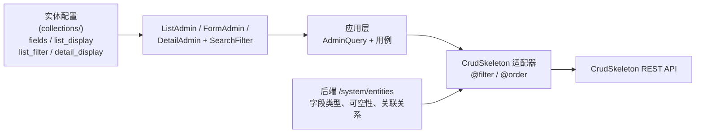

# crud-admin

<p align="center">
  <b>基于 Vue 3、Element Plus 和 EasyAdmin 的配置驱动后台管理系统</b>
  <br><br>
  
  
  
  
  <br><br>
</p>

> English: [README.md](README.md) · 繁體中文: [README.zh-Hant.md](README.zh-Hant.md) · 日本語: [README.ja.md](README.ja.md)

> 后端： [crud-skeleton](https://github.com/immane/crud-skeleton) — 基于 Symfony 8.1 的 API，含动态查询引擎和模块化架构

## 界面展示

<p align="center">
  
  
  
  <br>
  <em>控制台 · 列表视图 · 记录详情</em>
</p>

## 目录

- [功能特色](#功能特色)
- [技术栈](#技术栈)
- [国际化](#国际化)
- [项目结构](#项目结构)
- [快速开始](#快速开始)
- [配置](#配置)
- [EasyAdmin CRUD 引擎](#easyadmin-crud-引擎)
- [API 集成](#api-集成)
- [文档](#文档)
- [测试](#测试)
- [部署](#部署)
- [许可证](#许可证)

## 功能特色

- **配置驱动 CRUD 引擎（EasyAdmin）** — 在配置中声明实体，即可自动获得完整的列表/表单/详情/路由
- **21 种即插即用表单字段** — 文本输入、文本域、下拉选择、开关、数字、货币、日期、日期时间、图片、文件、JSON、JSON Schema、富文本、关联选择器、穿梭框、密码（双输入+强度提示）、邮箱（格式校验）等
- **表单校验** — `field.rules` / `field.validator` 合并至 `el-form`，插件可通过 `registerFieldValidator` 注入校验，未通过时阻断提交
- **JSON Schema 表单** — 将 JSON 对象渲染为已国际化的嵌套 FormAdmin 控件，并使用 Ajv 校验；支持静态或异步 Schema 提供者
- **带降级链的详情视图** — `detail/` → `list/` → 纯文本插件逐字段类型降级
- **国际化（i18n）** — 英文、简体中文、繁体中文、日文；浏览器语言自动检测；导航栏语言切换器；`Accept-Language` 请求头和 `_locale` 参数自动注入 API 请求
- **JWT 认证** — Bearer token 登录，自动刷新 token 轮换，Cookie 按端口隔离（`dream_studio_admin_token_{port}` 避免同主机跨端口冲突），并发请求排队
- **基于角色的权限控制** — 通过 Vuex + Vue Router 4 按用户角色过滤动态路由
- **实体自省** — 查询后端 `/system/entities` 自动推断字段类型、可空性和关联关系
- **动态筛选与排序** — 基于配置驱动的搜索 UI 生成服务端筛选表达式（`@filter`、`@order`）
- **企业控制台** — 实时订单/商品/用户指标、SVG 折线图、浏览器定位天气组件
- **响应式布局** — 可折叠侧边栏（SVG 图标）、面包屑导航、可选固定顶栏
- **代码分割与构建优化** — Vite 驱动的 chunk 分割和 tree-shaking
- **服务端健康监控** — 导航栏状态点轮询 `GET /health/live`、`/health/ready` 和 `/metrics`
- **Vitest 单元测试** — 101 个 spec 文件共 1330 项测试，`src/easyadmin/{ui/vue,core,application,adapters/crudskeleton}` 上强制 100% 覆盖率阈值
- **锁定文件已提交** — `package-lock.json` 已提交以保证可复现安装


## 技术栈

| 组件 | 技术 |
|-----------|-----------|
| 框架 | Vue 3.5 |
| UI 库 | Element Plus 2.9 |
| 状态管理 | Vuex 4 |
| 路由 | Vue Router 4 |
| HTTP | Axios |
| 构建 | Vite 5 |
| CSS | SCSS (Dart Sass) |
| 图标 | @element-plus/icons-vue + SVG sprite |
| 测试 | Vitest 2.1 |
| 类型 | TypeScript 6.0 |
| 后端 | [crud-skeleton](https://github.com/immane/crud-skeleton) (Symfony 8.1) |

## 国际化

系统首次加载时检测浏览器语言，并通过 `localStorage` 持久化选择。导航栏中的下拉菜单可随时切换语言——切换时会清除实体缓存并刷新页面。

| 语言 | 代码 | Element Plus | API Header |
|--------|------|-------------|------------|
| English（默认） | `en` | en | `Accept-Language: en`, `_locale=en` |
| 中文 (简体) | `zh` | zh-cn | `Accept-Language: zh`, `_locale=zh` |
| 中文 (繁體) | `zh-Hant` | zh-tw | `Accept-Language: zh-Hant`, `_locale=zh-Hant` |
| 日本語 | `ja` | ja | `Accept-Language: ja`, `_locale=ja` |

翻译键直接使用英文字符串（扁平格式），如 `$t('New / Edit')`。添加新语言只需新建 `src/i18n/{代码}.js` 文件并在导航栏下拉菜单中增加一项。

## 项目结构

```text
.
├── src/
│   ├── main.js                      # 应用入口：createApp、安装插件、挂载
│   ├── App.vue                      # 根组件（<router-view />）
│   ├── permission.js                # 路由守卫（认证 + 角色检查）
│   ├── settings.js                  # 应用标题、布局选项
│   ├── config.js                    # 声明式配置再导出
│   ├── api/                         # 接口定义（prefix、user/auth）
│   ├── assets/                      # 静态图片（登录背景、404）
│   ├── components/                  # 通用 UI（Breadcrumb、Hamburger、SvgIcon、Tinymce）
│   ├── easyadmin/                   # ⭐ 配置驱动 CRUD 引擎
│   │   ├── core/query/              # 纯查询模型（AdminQuery、FilterNode、排序、分页、DQL 工具）
│   │   ├── core/model/              # 实体标识、记录、字段配置、管理元数据
│   │   ├── core/ports/              # 仓储、元数据、编译器接口
│   │   ├── application/query/       # AdminQuery 构建 + URL 查询同步
│   │   ├── application/usecases/    # 保存、删除、批量、导出、关联、分批字段工具
│   │   ├── adapters/crudskeleton/   # 适配器、元数据提供器、CSQE 查询编译器
│   │   ├── adapters/graphql/        # 预留占位（暂无后端契约）
│   │   └── ui/vue/                  # Vue UI：List/Form/Detail/SearchFilter + 插件
│   │       ├── FormAdmin.vue        # 动态表单生成器
│   │       ├── ListAdmin.vue        # 动态列表/表格生成器
│   │       ├── DetailAdmin.vue      # 可配置记录详情页
│   │       ├── SearchFilter.vue     # 动态筛选 UI
│   │       ├── feedback.ts          # Element Plus 消息/加载工具
│   │       └── plugins/
│   │           ├── form/            # 21 个字段类型插件
│   │           ├── list/            # 10 个列表渲染插件
│   │           └── detail/          # 3 个详情专用插件
│   ├── configs/                     # 声明式实体配置
│   │   ├── routes.js                # 菜单/路由定义
│   │   ├── entities.js              # 自动加载器（import.meta.glob）
│   │   └── collections/             # 实体 Schema（10 个包：authorization、common、identity、inventory、payment、promotion、store、trade、wallet、wechat）
│   ├── i18n/                        # 语言文件（en、zh、zh-Hant、ja）
│   │   └── index.js                 # i18n 插件 + 浏览器语言检测
│   ├── icons/                       # SVG 雪碧图 + 旧图标兼容映射
│   ├── layout/                      # 侧边栏 + 导航栏 + 主内容区
│   ├── router/                      # Vue Router 4 + r()/g() 生成器
│   ├── store/                       # Vuex 4（自动加载 modules/）
│   ├── styles/                      # 全局 SCSS（侧边栏、过渡、覆写）
│   ├── types/                       # TypeScript 定义（admin、api）
│   ├── utils/                       # auth.js、request.ts 等
│   └── views/                       # 页面视图
│       ├── admin/                   # 通用 CRUD（list + form + detail）
│       ├── dashboard/               # 企业控制台
│       └── login/                   # 登录页
├── tests/unit/                      # 1330 项 Vitest 测试（101 个 spec 文件）
│   ├── components/                  # 组件 + 插件测试
│   ├── easyadmin/                   # core/application/adapter/golden/config 测试
│   └── store/、router/、utils/      # Store、路由、工具函数测试
├── docs/                            # design/、manual/、plan/、tasks/、ai/context.md
├── mock/                            # 历史遗留开发 API 模拟（未接入 Vite 构建）
├── public/                          # favicon.ico、.htaccess
├── index.html                       # Vite 入口 HTML
├── .env.development/.staging/.production
├── vite.config.ts                   # Vite 5 + Vue 3 + JSX 配置
├── vitest.config.ts                 # Vitest 配置（easyadmin 路径 100% 阈值）
├── tsconfig.json
└── package.json
```

## 快速开始

### 前置要求

- **Node.js** >= 18.0
- **npm** >= 9.0.0

### 1) 克隆

```bash
git clone https://github.com/immane/crud-admin.git
cd crud-admin
```

### 2) 安装

```bash
npm install
```

### 3) 配置环境变量

编辑开发环境文件（`.env.development` 已提交本地默认值，不提供 `.env.example`）：

```bash
# .env.development — 将代理指向你的后端
VITE_PROXY_TARGET=http://127.0.0.1:8000
```

关键变量：

```dotenv
VITE_BASE_API=
VITE_PROXY_TARGET=http://127.0.0.1:8000
VITE_API_PREFIX=/api/v1
VITE_AUTH_API_PREFIX=/api/auth
VITE_SYSTEM_API_PREFIX=/system
MEDIA_STORAGE_DEFAULT=local
```

### 4) 运行

```bash
npm run dev          # 开发（localhost:9528，热更新）
npm run build        # 生产构建
npm run lint         # ESLint
npm run type-check   # TypeScript 类型检查
npm run test         # Vitest
```

## 配置

### 环境文件

| 文件 | 用途 |
|------|---------|
| `.env.development` | 开发服务器（无构建产物） |
| `.env.staging` | 预发布构建 |
| `.env.production` | 生产构建 |

### 环境变量

| 变量 | 描述 | 默认值 |
|----------|-------------|---------|
| `VITE_BASE_API` | API 基础 URL | `''` |
| `VITE_PROXY_TARGET` | 开发代理目标 | — |
| `VITE_API_PREFIX` | 业务 API 前缀 | `/api/v1` |
| `VITE_AUTH_API_PREFIX` | 认证 API 前缀 | `/api/auth` |
| `VITE_SYSTEM_API_PREFIX` | 系统 API 前缀 | `/system` |
| `VITE_TINYMCE_SRC` | TinyMCE 脚本源 | `''` |
| `MEDIA_STORAGE_DEFAULT` | 默认上传存储驱动（`local` / `qiniu`） | `local` |

### 构建自定义配置

`vite.config.ts` 关键设置：
- **base**：生产环境 `/admin/`，开发环境 `/`
- **开发代理**：`/api`、`/system`、`/health`、`/metrics`、`/upload`、`/uploads` 代理至 `VITE_PROXY_TARGET`
- **插件**：`@vitejs/plugin-vue` + `@vitejs/plugin-vue-jsx`
- **别名**：`@` → `src/`
- **Define**：编译时注入 `process.env.VITE_*`

## EasyAdmin CRUD 引擎

EasyAdmin 是本项目的核心——一个**配置驱动引擎**，能够根据声明式实体定义**自动生成 CRUD 界面**。


```mermaid
flowchart LR
    Config["实体配置<br/>(collections/)<br/>fields / list_display<br/>list_filter / detail_display"] --> UI["ListAdmin / FormAdmin /<br/>DetailAdmin + SearchFilter"]
    UI --> Query["应用层<br/>AdminQuery + 用例"]
    Query --> CSQE["CrudSkeleton 适配器<br/>@filter / @order"]
    Meta["后端 /system/entities<br/>字段类型、可空性、关联关系"] --> CSQE
    CSQE --> API["CrudSkeleton REST API"]
```

### 第一步 — 定义实体配置

在 `src/configs/collections/common/Content.js` 中：

```js
import { t } from '@/i18n'
import axios from '@/utils/request'
import { API_PREFIX, apiPath } from '@/api/prefix'
import { orderByIdDesc } from '../helpers'

export default {
  Content: {
    form: {
      fields: [
        'title',
        { property: 'body', required: true },
        { property: 'category', required: false, tab: `${t('Metadata')}` },
        { property: 'tags', required: false, tab: `${t('Metadata')}` }
      ],
      batch_edit: {
        fields: ['category', 'tags']
      }
    },
    list: {
      query: orderByIdDesc,
      list_filter: {
        title: t('Title'),
        'category.id': () => axios
          .get(apiPath(API_PREFIX, 'manage/categories'))
          .then(res => Object.assign({ __label: t('Category') }, ...res.data.map(v => ({ [v.id]: v.name }))))
      },
      list_display: ['id', 'title', 'category', 'tags', 'createdAt', 'updatedAt']
    },
    detail: {
      detail_display: '__all__'
    }
  }
}
```

### 第二步 — 注册路由

在 `src/configs/routes.js` 中：

```js
import { r } from '@/router/generator'
import { t } from '@/i18n'
{
  path: '/content', component: Layout,
  meta: { title: t('Content Management'), icon: 'el-icon-notebook' },
  children: [...r('Content', t('Content'))]
}
```

**仅此而已** — 你已拥有自动翻译的完整列表页、表单页和详情页。

### 字段类型插件

EasyAdmin 内置 21 种字段类型插件，根据实体元数据自动解析：

| 插件 | 类型 | 描述 |
|--------|------|-------------|
| `input.vue` | string（默认） | 文本输入框 |
| `textarea.vue` | text | 多行文本域 |
| `text.vue` | — | TinyMCE 富文本编辑器 |
| `boolean.vue` | boolean | 复选框 |
| `integer.vue` | integer | 数字输入框 |
| `currency.vue` | currency | 带货币代码的数字输入框（元输入、分存储） |
| `select.vue` | — | 下拉选择器 |
| `date.vue` | date | 日期选择器 |
| `datetime.vue` | datetime | 日期时间选择器 |
| `image.vue` | image | 图片上传/预览 |
| `file.vue` | — | 文件上传 |
| `json.vue` | — | JSON 编辑器（代码/树视图） |
| `json_schema.vue` | `json_schema` | 由 JSON Schema 生成的嵌套表单，使用 Ajv 校验 |
| `json-custom.vue` | — | 嵌套子对象编辑器 |
| `array.vue` | array | 数组编辑器（选择器或嵌套表单） |
| `RelationToOne.vue` | ManyToOne、OneToOne | 单选关联（含远程搜索） |
| `RelationToMany.vue` | ManyToMany、OneToMany | 多选关联 |
| `transfer.vue` | — | 穿梭框组件 |
| `code.vue` | — | 代码文本域 |
| `password.vue` | — | 密码（可视切换、遮蔽时双输入、6位+字母数字+一致性提示，校验不通过阻断提交） |
| `email.vue` | — | 邮箱（实时格式提示，非法时阻断提交） |

### 字段配置参考

```ts
interface FieldOption {
  property: string           // 实体属性名（必填）
  label?: string             // 覆盖显示标签
  type?: string              // 强制字段类型
  required?: boolean         // 覆盖后端可空性元数据
  editable?: boolean         // 列表视图中可内联编辑
  tab?: string               // 分组到指定标签页
  default_value?: unknown    // 新增模式下的默认值
  field_options?: object     // 传递给 el-form-item 的 Props
  field_events?: object      // 绑定到 el-form-item 的事件
  type_options?: object      // 传递给字段插件的 Props
  type_events?: object       // 绑定到字段插件的事件
  hidden?: boolean | string | string[] | Function  // true/false、'create'/'update'/'edit'、数组或 (form, id) 判定函数
  relation_filter?: object   // 关联查询的筛选条件
  relation?: object         // 关联目标覆盖（entity、valueKey、cardinality）
  component?: object         // 自定义组件（JSX 渲染函数）
  help?: string              // 字段下方帮助文本
  full_width?: boolean       // 详情视图中跨满网格列宽
}
```

### JSON Schema 表单

当 JSON 对象有确定的数据契约时，使用 `json_schema` 生成普通表单控件，而不是使用原始 JSON 编辑器。静态 Schema 应与实体配置放在同一目录，例如
`src/configs/collections/store/StoreAddress.json` 与 `StoreContact.json`。

```js
import StoreAddressSchema from './StoreAddress.json'

{
  property: 'address',
  type: 'json_schema',
  required: false,
  type_options: { schema: StoreAddressSchema }
}
```

`schema` 也可以是接收 `{ entity, id, property, form }` 的异步函数，为后端生成的 Schema 预留相同接口。Schema 的标签、描述和枚举标签会自动经过 `t()`；Ajv 会在提交时校验完整对象。可选空值不会参与校验，必填项仍会校验，嵌套对象中的 `null` / `undefined` 不会传入请求。将相同字段定义放入 `detail.detail_display`，即可在详情页按 Schema 顺序显示标签和值。支持的关键字与复杂 Schema 的降级策略见[配置参考手册](docs/manual/config-reference.zh.md)。

### 表单校验

FormAdmin 会将 `field.rules` / `field.validator` 合并到 `el-form` 校验中，插件也可通过 `inject('registerFieldValidator')` 注册校验，未通过时阻断提交。示例：

```js
// User.js
{
  property: 'plainPassword',
  type: 'password', // 遮蔽时双输入、强度提示，未通过 6位+字母+数字时阻断提交
  help: t('User password help')
},
{ property: 'email', type: 'email' } // 实时提示 + 非法阻断
```

内置校验位于 `src/utils/validate.js`（`isPasswordCompliant`、`createPasswordValidator`、`isEmailValid`、`createEmailValidator`），并由 password/email 插件使用。

### 路由生成器

| 函数 | 行为 |
|----------|----------|
| `r(entity, title)` | 重定向路由 — 复用 `admin/list.vue`、`admin/form.vue`、`admin/detail.vue`（推荐） |
| `g(entity, title)` | 直接路由 — 期望每个实体有独立的视图文件（预留备选方案） |

> `r()` 已可满足几乎所有 CRUD 场景，包括嵌套子表单、JSX 自定义组件、关联搜索、详情降级链和异步筛选函数。`g()` 保留为备选方案，用于需要完全独立页面的极端情况，实际项目中很少使用。

## API 集成

### Axios 实例 (`src/utils/request.ts`)

- **Base URL**：来自环境变量的 `VITE_BASE_API`
- **超时时间**：30 秒
- **请求拦截器**：注入 `Authorization: Bearer <token>` 请求头、`Accept-Language` 请求头和 `_locale` 查询参数
- **响应拦截器**：遇到 401 自动刷新 token；将并发失败的请求排队到单次刷新之后

### API 响应格式

```json
{
  "code": 0,
  "message": "SUCCESS",
  "data": {},
  "paginator": { "totalCount": 42 }
}
```

### 期望的后端接口

| 接口 | 方法 | 描述 |
|----------|--------|-------------|
| `/api/auth/login` | POST | 用户认证 |
| `/api/auth/token/refresh` | POST | 轮换 refresh token |
| `/api/auth/logout` | POST | 作废 refresh token |
| `/api/v1/app/users/me` | GET | 当前用户信息 + 角色 |
| `/system/entities` | GET | 列出所有实体类名 |
| `/system/entities/{entity}` | GET | 实体字段元数据 |
| `/api/v1/manage/{entity}` | GET/POST | 实体列表 / 创建 |
| `/api/v1/manage/{entity}/{id}` | GET/PUT/DELETE | 实体详情 / 更新 / 删除 |

## 文档

- **[架构设计](docs/design/architecture.md)** — 系统分层、启动流程、认证流程、路由、状态管理
- **[代码与 API 契约](docs/design/contracts.md)** — 请求/响应格式、组件 Props 契约
- **[EasyAdmin 设计](docs/design/easyadmin-design.md)** — 插件系统、数据流、扩展点
- **[EasyAdmin 配置契约](docs/design/easyadmin-config-contract.md)** — 完整配置 Schema 参考
- **[配置参考手册](docs/manual/config-reference.zh.md)** — EasyAdmin 配置完整指南，从入门到高级
- **[AI 上下文](docs/ai/context.md)** — 面向 AI 辅助开发的快速参考
- **[EasyAdmin 查询适配器计划](docs/plan/easyadmin-query-adapter-architecture.md)** — 分层查询/编译器/适配器架构与迁移阶段
- **[Vue 3 迁移计划](docs/plan/vue3-tsx-vite-migration.md)** — 迁移说明及当前状态

## 测试

**1330 项测试，共 101 个 spec 文件 · Vitest 2.1 · `src/easyadmin/{ui/vue,core,application,adapters/crudskeleton}` 上 100% statements/branches/lines 覆盖率阈值**

```bash
npm run test              # 运行全部测试（CI 中关闭 watch 模式）
npm run test:related      # 运行与变更文件相关的测试
npm run test:coverage     # 运行并生成覆盖率报告
npm run type-check        # TypeScript 类型检查
npm run test:ci           # CI（类型检查 + 测试）
```

测试文件位于 `tests/unit/`：
- **组件测试**：Breadcrumb、Hamburger、SvgIcon、EasyAdmin feedback UI
- **工具函数测试**：`request.ts`、`validate.js`、`formatTime`、`parseTime`、`param2Obj`，以及 EasyAdmin 查询 core/adapter golden 测试

配置文件：`vitest.config.ts`（jsdom 环境，Vue 3 插件；`src/easyadmin/{ui/vue,core,application,adapters/crudskeleton}` 上强制 100% statements/branches/lines 阈值）。

CI：GitHub Actions 运行类型检查、分片单元测试和覆盖率任务。仅文档/配置/i18n 变更会被路径过滤跳过 CI 任务。

## 部署

### 构建产物

```
dist/
├── index.html
├── favicon.ico
└── static/
    ├── index-[hash].js
    ├── index-[hash].css
    └── ...（带内容哈希的图片与字体文件）
```

### 部署说明

1. 在 `.env.production` 中将 `VITE_BASE_API` 设为你的 API 服务器地址
2. 运行 `npm run build`
3. 将 `dist/` 目录部署到你的 Web 服务器
4. 配置客户端路由 — 将所有路径重定向至 `index.html`：
   - **Nginx**：`try_files $uri $uri/ /admin/index.html;`
   - **Apache**：使用 `.htaccess` + mod_rewrite

## 许可证

MIT

## 致谢

本项目基于以下优秀项目构建：

- [vue-admin-template](https://github.com/PanJiaChen/vue-admin-template) — Vue 2 基础模板（已停止维护）
- [Element UI](https://element.eleme.io/) — 原始 UI 组件库
