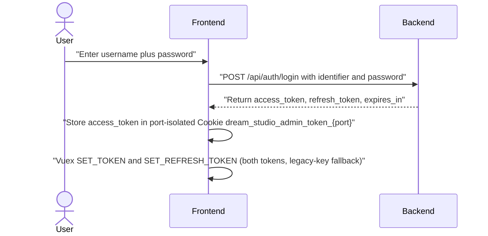
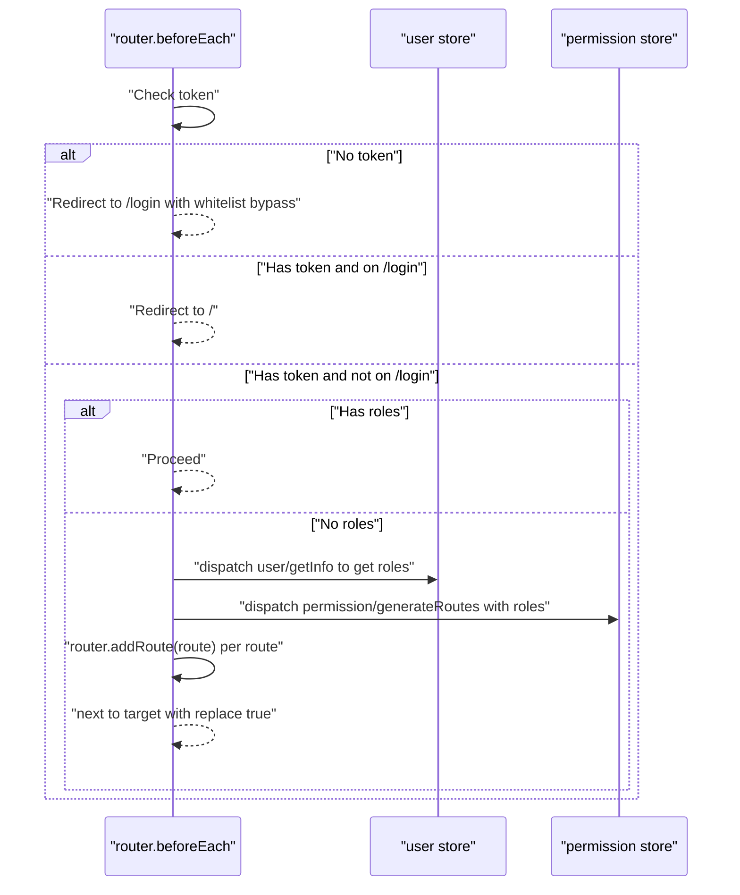
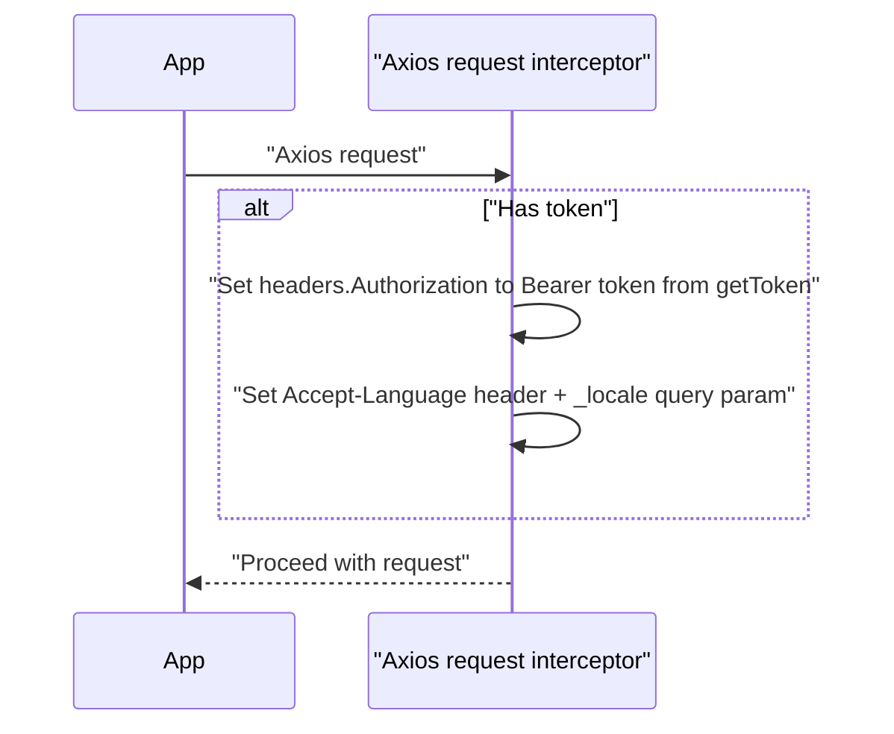
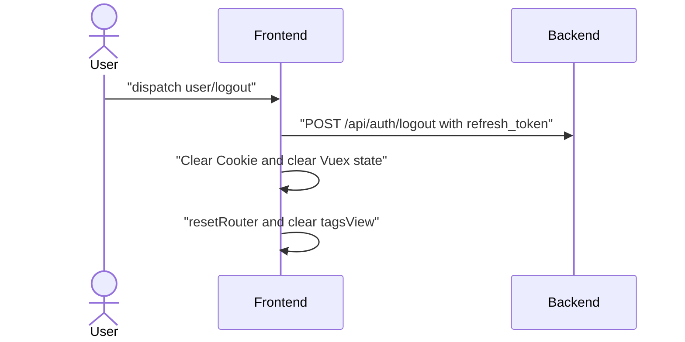

# Architecture Design

> Vue Admin Skeleton — Architecture Design Document  
> Last updated: 2026-09-18

---

## 1. System Layers

```mermaid
flowchart TB
    subgraph Presentation ["Presentation Layer"]
        P1["index.html → src/main.ts → src/main.js → App.vue"]
        P2["Layout - Shell - Sidebar plus Navbar plus AppMain"]
        P3["Views - Page Components - login, dashboard, admin"]
        P4["Components - Shared UI - Breadcrumb, Hamburger, SvgIcon, AdminSkeleton"]
    end
    subgraph Routing ["Routing Layer"]
        R1["src/permission.js - Navigation Guard - Auth plus Role Check"]
        R2["src/router - Vue Router - history mode, base / (dev) or /admin/ (prod)"]
        R3["src/router/generator - r and g Route Generators"]
    end
    subgraph State ["State Management Layer"]
        S0["src/store - Vuex auto-loaded namespaced modules"]
        S1["user - Auth State - token, roles, profile"]
        S2["permission - Dynamic Route Generation"]
        S3["app - Sidebar State, Device Detection"]
        S4["entity - Entity Schema Cache - sessionStorage"]
        S5["tagsView - Open Tab State"]
        S6["settings - App Settings"]
    end
    subgraph Business ["Business Logic Layer"]
        B1["src/easyadmin/adapters/crudskeleton - CrudSkeletonAdapter + MetaProvider"]
        B2["src/utils/request.ts - Axios Instance plus JWT Interceptor"]
        B3["src/api - API Endpoint Definitions"]
        B4["src/configs - Declarative Entity and Route Configs"]
    end
    subgraph Engine ["EasyAdmin Engine Layer"]
        E1["FormAdmin.vue - Dynamic Form Generator"]
        E2["ListAdmin.vue - Dynamic Table and List Generator"]
        E3["SearchFilter.vue - Dynamic Filter Builder"]
        E4["plugins/form - 17 Field-Type Plugins"]
        E5["plugins/list - List Cell Plugins"]
    end
    P4 --> R1
    R3 --> S0
    S6 --> B1
    B4 --> E1
```



---

## 2. Bootstrap Flow

```
1. index.html loads /src/main.ts (Vite entry, one-line bridge)
2. main.ts → import './main.js'
3. main.js executes in order:
   a. normalize.css (CSS reset)
   b. createApp(App) (Vue 3, no Vue.use/new Vue)
   c. Import global SCSS
   d. Import App.vue, store, router
   e. Register SVG icons globally (installIcons + installLegacyIcons)
   f. Install i18n (locale from app_locale: en/zh/zh-Hant/ja, synced to Element Plus) + applyTheme
   g. Register a no-op fit-columns directive stub; import navigation guard (permission.js, side-effect import)
   h. Mount to #app
```

---

## 3. Authentication Flow

### 3.1 Login



### 3.2 Route Guard



`resetRouter()` removes dynamic routes one by one via `removeRoute(name)`.

### 3.3 Request Interception



Responses without a business `code` are wrapped; failures surface `ElMessage`
plus `Promise.reject`.

### 3.4 Logout



### 3.5 Token Refresh

Expired requests (HTTP 401 or business code 401) queue behind a single shared
`refreshPromise` so the refresh token is used once even under concurrency:

```
POST /api/auth/token/refresh { refresh_token }
→ { access_token, refresh_token } (both rotated)
```

On success the original requests retry with the new token; on failure
`clearSession()` → `resetToken()` → redirect `/login`. The auth endpoints
(`login`, `logout`, `token/refresh`) are excluded from retry.

---

## 4. Routing Design

### 4.1 Route Mode

- Mode: `history` (no hash)
- Base: `/admin/` (production) / `/` (development)

### 4.2 Route Categories

| Type | When | Composition |
|------|------|-------------|
| `constantRoutes` | App startup | /login, /404, /dashboard |
| `asyncRoutes` | After login (dynamic) | admin.routes (configs) + catch-all EasyAdmin routes + 404 fallback |

### 4.3 Dynamic Route Generation

```
asyncRoutes = [
  ...admin.routes,          // from src/configs/routes.js
  { path: '/:pathMatch(.*)*', redirect: '/404' }
]
```

`admin.routes` is defined in `src/configs/routes.js`, using `r()` to generate dummy redirect routes:

```
/dummy/{entityPath}/create  → redirect  → /{entityPath}/create
/dummy/{entityPath}/:id/update → redirect → /{entityPath}/:id/update
/dummy/{entityPath}/:id/detail → redirect → /{entityPath}/:id/detail
/dummy/{entityPath}/list    → redirect  → /{entityPath}/list
```

The 8 EasyAdmin CRUD routes (`EasyAdminCreate/Update/UuidUpdate/Detail/
UuidDetail/IdList/UuidList/List`, numeric `:id(\d+)` vs 36-char `:uuid` split)
live in `lastRoutes`, Layout-wrapped and loaded at startup
(`constantRoutes + lastRoutes`); `asyncRoutes` only carries the menus plus the
404 catch-all. Actual rendering is handled by the `/:entityParam/*` family of
routes, which resolve to `views/admin/list.vue` or `views/admin/form.vue`.

---

## 5. State Management

### 5.1 Auto-Loading Mechanism

```js
// src/store/index.js
const modulesFiles = import.meta.glob('./modules/**/*.js', { eager: true })
// Auto-scan and register all ./modules/*.js as namespaced Vuex modules
```

### 5.2 Module Responsibilities

| Module | Key State | Key Actions |
|--------|-------------|-------------|
| `user` | token, refreshToken, roles, name | login, getInfo, logout, resetToken, changeRoles |
| `permission` | routes, addRoutes | generateRoutes(roles) |
| `app` | sidebar.opened, device | toggleSideBar, closeSideBar, toggleDevice |
| `entity` | entities[], structures{} | set_entities, set_structures, reset |
| `tagsView` | visitedViews[], cachedViews[] | add/del/delOthers/delAll variants for visited + cached views |
| `settings` | fixedHeader, sidebarLogo | changeSetting |

### 5.3 Permission Filtering Logic

```
generateRoutes(roles):
  if roles includes 'ROLE_SUPER_ADMIN' or 'ROLE_ADMIN':
    return ALL asyncRoutes
  else:
    return filterAsyncRoutes(asyncRoutes, roles)
      → recursively filter, keep routes where meta.roles ∩ user.roles ≠ ∅
```

---

## 6. API Layer

### 6.1 Axios Instance

| Config | Value |
|--------|-------|
| baseURL | `VITE_BASE_API` (env variable) |
| timeout | 30s |
| Request interceptor | `Authorization: Bearer {token}` |
| Response interceptor | Check code ∈ {0, 200}, handle 204 |

### 6.2 API Prefixes

| Constant | Default (`api/prefix.ts`, no leading slash — restored by `apiPath()`) | Env Variable |
|----------|---------|--------------|
| API_PREFIX | `api/v1` | VITE_API_PREFIX |
| AUTH_API_PREFIX | `api/auth` | VITE_AUTH_API_PREFIX |
| SYSTEM_API_PREFIX | `system` | VITE_SYSTEM_API_PREFIX |

Note: the upload endpoint (`POST /api/v1/manage/media/upload`) is hardcoded in
`utils/upload.js` and ignores a custom `VITE_API_PREFIX`.

### 6.3 Endpoint Mapping

| Function | Method | Path |
|----------|--------|------|
| Login | POST | `/api/auth/login` |
| Token refresh | POST | `/api/auth/token/refresh` |
| User info | GET | `/api/v1/app/users/me` (no args — auth travels in the header) |
| Logout | POST | `/api/auth/logout` |
| Entity list | GET | `/system/entities` |
| Entity structure | GET | `/system/entities/{fqcn}` (matched by FQCN suffix; throws `No entity was found` on miss) |
| CRUD | GET/POST/PUT/DELETE | `/api/v1/manage/{plural}[/{pk}]` |

---

## 7. Build Configuration

### 7.1 Vite Config (`vite.config.ts`)

| Setting | Development | Production |
|---------|-------------|------------|
| base | `/` | `/admin/` |
| server.port | 9528 | — |
| server.proxy | `/api`, `/system`, `/health`, `/metrics`, `/upload`, `/uploads` → VITE_PROXY_TARGET | — |
| plugins | @vitejs/plugin-vue + @vitejs/plugin-vue-jsx | same |
| alias | `@` → `src/` | same |
| define | Inject process.env.VITE_* | same |

### 7.2 Environment Variables

| Variable | Dev | Staging | Production |
|----------|-----|---------|------------|
| VITE_BASE_API | `''` | `/stage-api` | `''` |
| VITE_PROXY_TARGET | Backend URL | — | — |
| VITE_API_PREFIX | `/api/v1` | `/api/v1` | `/api/v1` |
| VITE_AUTH_API_PREFIX | `/api/auth` | `/api/auth` | `/api/auth` |
| VITE_SYSTEM_API_PREFIX | `/system` | `/system` | `/system` |
| MEDIA_STORAGE_DEFAULT | `local` | — | — |
| VITE_TINYMCE_SRC | `''` | — | — |

---

## 8. Module Dependency Rules

Dependency direction between layers is strictly one-way:

```
Views / Engine  →  Configs  →  (data, schemas, plain components)
     ⛔ Configs must never statically import Engine/Views SFCs
```

Rationale: `configs/entities.js` eagerly loads **every** collection module,
and `FormAdmin`/`ListAdmin` both import `entities`. A single static `.vue`
import inside any collection file (as `trade/Product.jsx` once did) closes the
eager cycle `FormAdmin → entities → Product.jsx → ListAdmin → FormAdmin`.
The failure is order-dependent — it can survive fresh page loads and detonate
after HMR or any import-graph change — with the signature `Cannot access
'FormAdmin' before initialization` plus blank async chunks (e.g. both
`json_schema` frames gone).

Rules:

1. Collection/config modules may only import data, schemas, utilities, and
   `defineAsyncComponent(() => import(...))` lazy boundaries — never static
   `.vue` components.
2. `vite build` must report no `Circular dependency` warnings; treat any as a
   defect, not noise.
3. The async boundary is regression-tested
   (`tests/unit/easyadmin/configs/product-async-admin.spec.js`).

Related runtime guard: `FormAdmin` nesting depth (`easyadminFormDepth`,
top-level = 1, placeholder past `MAX_FORM_NESTING_DEPTH` = 10) bounds
self-referencing form configs — see EasyAdmin Design §9.
