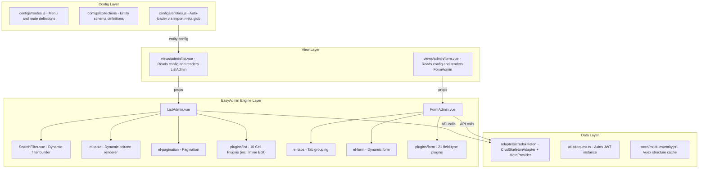

# EasyAdmin Design

> Vue Admin Skeleton — EasyAdmin Engine Design Document  
> Last updated: 2026-09-18

---

## 1. Overview

EasyAdmin is the core CRUD engine of Vue Admin Skeleton. It is a **configuration-driven** system that automatically generates complete CRUD interfaces (list + form + filter + routes) from declarative entity definitions — no boilerplate code required.

### Design Goals

- **Zero boilerplate**: Define config → auto-generate CRUD UI
- **Extensible**: Plugin-based field type system with custom rendering support
- **Metadata-driven**: Automatically infer field types, validation rules, and relations from the backend API
- **Declarative filtering**: DQL expression-driven filter builder
- **Two-tier caching**: Vuex + sessionStorage for entity structure caching

---

## 2. Core Architecture



---

## 3. Data Flow

```mermaid
flowchart TD
    A["User visits entity list route with entityParam"]
    B["views/admin/list.vue - Extract route params entityParam"]
    C["Camelize entityParam and lookup admin.entities by alias"]
    D["Pass config to ListAdmin component"]
    E["ListAdmin created - Create CrudSkeletonAdapter instance"]
    F["Call dataProcessor - default em.structure plus em.list"]
    G["Build table columns from list_display config"]
    H["Render el-table"]
    I["User clicks Create - router.push to entity create route"]
    J["views/admin/form.vue - Same entityParam extraction"]
    K["Pass config fields to FormAdmin component"]
    L["FormAdmin created - Create CrudSkeletonAdapter instance"]
    M["Call em.structure to get field metadata"]
    N["Transform fields - string to property object"]
    O["Generate validation rules from metadata nullable"]
    P["Build tabs from field tab"]
    Q["If editing - em.retrieve with id to populate form"]
    R["If creating - apply default_value"]
    S["FormAdmin submit - el-form validate"]
    T["cleanBlankAttributes"]
    U["em.create or em.update"]
    V["router.go back one step"]
    A --> B --> C --> D --> E --> F --> G --> H --> I --> J --> K --> L --> M --> N --> O --> P --> Q --> R --> S --> T --> U --> V
```



---

## 4. Plugin System

### 4.1 Plugin Loading Mechanism

```
FormAdmin.loadPlugin(type):
  1. Type normalization:
     'images' → 'image'
     'datetime_immutable' → 'datetime'
     'ManyToOne' → 'RelationToOne'
     'OneToOne' → 'RelationToOne'
     'ManyToMany' → 'RelationToMany'
     'OneToMany' → 'RelationToMany'
  2. Lookup ./plugins/form/{normalizedType}.vue
  3. Not found (or empty/unknown type) → fall back to input.vue
  4. Lazy load: cached defineAsyncComponent()
```

### 4.2 Type Resolution Priority

```
1. field.relation + resolveRelation() — relation plugins first
2. field.type (explicitly set in config)
3. structure[field.property].metadata.type, allowlisted only:
   array, boolean, code, date, datetime, datetime_immutable, file, image,
   images, integer, json, text, textarea, transfer
   (anything else — including string, currency, email, password,
   json_schema, select — falls through)
4. 'input' — final fallback
```

### 4.3 Plugin Props Contract

Each plugin receives:

```typescript
{
  form: Record<string, any>     // Reactive form object
  field: FieldOption             // Current field config
  struct?: {                     // Backend metadata (optional)
    metadata: {
      type: string
      nullable: boolean
      targetEntity?: string
    }
  }
  emPrefix?: string              // API prefix
}
```

Plugins receive additional config via `v-bind="field.type_options"` and `v-on="field.type_events"`.
Most plugins declare only the `form` + `field` props; `struct`/`emPrefix`/`inject`
appear only where needed (`RelationToOne/Many`, `transfer`, `password`, `email`,
`json_schema`).

### 4.4 Plugin List

| Plugin File | Type Mapping | Render Component |
|-------------|--------------|------------------|
| `input.vue` | string (default) | `<el-input>` |
| `textarea.vue` | text | `<el-input type="textarea">` |
| `text.vue` | text | `<Tinymce>` (rich text) |
| `boolean.vue` | boolean | `<el-checkbox>` |
| `integer.vue` | integer | `<el-input-number>` |
| `currency.vue` | currency | `<el-input-number>` (yuan input, cents storage via `type_options.multiplier`) |
| `select.vue` | — | `<el-select>` |
| `date.vue` | date | `<el-date-picker>` (yyyy-MM-dd) |
| `datetime.vue` | datetime | `<el-date-picker>` (yyyy-MM-dd HH:mm:ss) |
| `image.vue` | image / images | `<el-upload>` (`list-type="picture"`; single image vs multi-image) |
| `file.vue` | — | `<el-upload>` (single file, configurable `storage` driver) |
| `code.vue` | — | CodeMirror 6 editor (js/ts/json/html/css/sql, line numbers, history) |
| `json.vue` | — | `<jsoneditor>` (tree/code view, `mode`/`modes` options) |
| `json_schema.vue` | `json_schema` | Nested generated `<FormAdmin>` with Ajv validation |
| `json-custom.vue` | — | Nested `<FormAdmin>` (sub-object editor) |
| `array.vue` | array | `<el-select multiple>` or nested `<FormAdmin>` (`entity-conf="Option"`) |
| `RelationToOne.vue` | ManyToOne, OneToOne | `<el-select>` (remote search, `creationUrl` button, uuid hydration) |
| `RelationToMany.vue` | ManyToMany, OneToMany | `<el-select multiple>` (remote search) |
| `transfer.vue` | — | `<el-transfer>` (extends RelationToMany, `key: value` / `label: label` mapping) |
| `password.vue` | password | `<el-input type="password">` with show/hide, double-entry when masked, 6+ chars + letter+number + match hints, blocks submit |
| `email.vue` | email | `<el-input type="email">` with live format hint, blocks on invalid |

---

## 5. List Column Rendering

### 5.1 Render Priority (ListAdmin)

Single dispatch via `getListPluginType(field, struct, value)` (not tiered checks):

```
relation (+resolveRelation)? → RelationToMany (multiple) / RelationToOne
no type at all?              → Array value → RelationToMany, else inline strip
boolean/currency/date/datetime/datetime_immutable/image/array → same-named plugin
ManyToOne/OneToOne           → RelationToOne (__toString + router-link + uuid resolve)
ManyToMany/OneToMany         → RelationToMany (<el-tag> list, max 5 + tooltip)
anything else                → inline HTML strip (no plugin)
```

Fallback renders stripped plain text inline (`htmlStrip`); `plugins/list/plain-text.vue`
is not wired into the dispatch. Inline edit (`field.editable`) applies to
`string/integer/float/decimal` fields (never `id`/`image`), falling back to
`struct.metadata.type` when `field.type` is unset.

### 5.2 Relation Field Extraction

```js
// Supports nested property paths
extractFields(dataObject, 'user.profile.phone')
// → dataObject.user.profile.phone
```

---

## 6. Filter System (SearchFilter)

### 6.1 Filter Flow

```
SearchFilter.created():
  filterProcess():
    Iterate listFilter keys
    Async functions → await → transform result
    Reduced style → auto-generate DQL expression
    Full style → use provided expression

User clicks Search:
  filterGenerate():
    Replace :value placeholders
    Merge with base query['@filter'] (using &&)
    Trigger fetchDataFunc()
```

### 6.2 DQL Expression Rules (backend-verified)

Against crud-skeleton `ExpressionDqlParser`:

- Filter paths must use `entity.getX()` chains. Bare property access
  (`entity.status`), `is*`/`has*` getters (`entity.isSystem()`), and bare
  names are not DQL-safe (non-admin → HTTP 403, admin → full-table
  in-memory fallback). Boolean `isSystem` properties are queried as
  `entity.getIsSystem()`.
- Join with `&&` / `||` (never `and` / `or`). Null tests: bare
  `entity.getX()` (`IS NOT NULL`) or `!entity.getX()` (`IS NULL`) —
  never `== null`.
- Sort with `@order` (`field|DIR`, comma-separated). Never `@sort`
  (admin-only in-memory comparator).

### 6.3 Filter Widget Types
| type | Widget |
|------|--------|
| `datetime` / `date` / `time` | `<el-date-picker>` |
| `input` | `<el-input>` (search icon) |
| `boolean` | `<el-switch>` |
| `select` (default) | `<el-select>` (filterable, clearable) |
| custom | `field.component` rendered directly |

---

## 7. CrudSkeletonAdapter Class

`CrudSkeletonAdapter` implements the core `AdminRepository` port
(`retrieve`/`list`/`create`/`update`/`delete`/`deleteMany`/`batchUpdate`) and
the `MetaProvider` port (`listEntities`/`getStructure`); metadata flows
through `CrudSkeletonMetaProvider` (Vuex-first, then `GET
/system/entities[/{fqcn}]`) while the Vuex store remains the persistence
detail. Query shaping goes through `CrudSkeletonQueryCompiler.compile()`; the
identity rules (name/prefix/plural defaults) live in
`resolveEntityIdentity`.

### 7.1 Constructor

```typescript
constructor(conf: string | {
  name: string      // Entity name (e.g. "Product")
  prefix?: string   // API prefix (default "/api/v1/manage")
  plural?: string   // Plural form (default auto-inferred)
})
```

### 7.2 Pluralization

Uses the `i` (inflect) library:

Route paths use `dasherize(underscore(name))`; API plurals use
`dasherize(underscore(pluralize(name)))` unless overridden:

| Entity Name | Route Path | Default Plural |
|-------------|------------|----------------|
| Product | `product` | `products` |
| Category | `category` | `categories` |
| Transaction | `transaction` | `transactions` (`wallet-` prefixes only via explicit `plural` override) |

Can be overridden via `{ plural: 'transactions' }`.

### 7.3 Structure Caching Strategy

```
structure():
  1. Check Vuex store.entity.structures[entityName]
  2. Cache hit → return directly
  3. No cache → GET /system/entities/{fqcn}
  4. Store in Vuex → auto-persist to sessionStorage
  5. sessionStorage keys: dream_studio_entities, dream_studio_structures
```

---

## 8. Custom Extension Points

### 8.1 FormAdmin Slots

| Slot | Location | Usage |
|------|----------|-------|
| `formTitle` | Top of form | Custom title area |
| `filter` | Top-right area | Filter/searcher slot |
| `topButton` | Top-right area | Action buttons |
| `{field.property}` | Per field position | Override single field rendering (`form`/`value`/`struct` scope) |
| `action` | Bottom of form | Submit actions (`form`/`submit` scope) |

### 8.2 ListAdmin Slots

| Slot | Location | Usage |
|------|----------|-------|
| `title` / `titleText` | Toolbar title | Custom title area |
| `filter` | Below search bar | Custom filter area |
| `extraTopButton` / `topButton` | Next to create button | Top action buttons |
| `tableSelection` | Table | Selection column area |
| `{field.property}` | Per column position | Override column rendering (`value`/`record`/`refresh` scope) |
| `extraAction` | End of action column | Extra action buttons |
| `action`, `action:detail`, `action:edit`, `action:delete` | Per row action column | Custom row actions |

### 8.3 Custom Components

```js
// Vue 3: plain component objects (markRaw/toRaw when stored in reactive
// field configs to keep Vue from making them reactive)
{
  property: 'amount',
  component: {
    props: ['data'],
    template: `<span :style="{ color: data > 0 ? 'green' : 'red' }">{{ data }}</span>`
  }
}
```

### 8.4 Custom Field Plugins

```
src/easyadmin/ui/vue/plugins/form/my-custom.vue
```

As long as the plugin follows the Plugin Props Contract, it will be automatically discovered and loaded by `import.meta.glob`.

---

## 9. Nested Forms & Safety Guards

FormAdmin nests inside FormAdmin through four paths: `json_schema` object
properties, `array` sub-object items, ListAdmin edit/batch dialogs, and custom
`component:` field components (e.g. `SpecificationManager` in `Product.jsx`).
Three guards keep nesting safe:

### 9.1 v-model Echo Guard (deep equality)

The nested `v-model="form[field.property]"` emits a fresh object copy on every
sync, so the parent/embedded `form` + `modelValue` watchers compare with
order-insensitive deep equality (`isDeepEqual` in
`src/utils/json-schema-form.js`). A reference check alone ping-pongs the same
value forever (`Maximum recursive updates exceeded`) and can starve sibling
schema forms on create.

### 9.2 Outer Validation Refresh

Nested inputs only reach the inner form items, so the outer field's error state
would stay red after the first failure. `json_schema.vue` watches its nested
value and re-runs the parent `validateField(property)` once a validation has
run (`validatedOnce`; pristine fields are never marked). Same `triggerValidate`
pattern as the email/image/file plugins. The Ajv validator semantics are
unchanged: empty optional roots pass, empty required roots fail, blank optional
properties are stripped from the validation copy only.

### 9.3 Nesting Depth Guard

`FormAdmin` provides its depth (`easyadminFormDepth`, top-level = 1) via
`provide`/`inject`, which flows through plugins, dialogs, and custom
components without their cooperation. Past `MAX_FORM_NESTING_DEPTH` (10, in
`FormAdmin.vue`) the form renders a warning placeholder
(`Form nesting too deep — check for circular form references`, translated in
all four locales) and skips structure fetching. Genuine trees nest at depth
2–4; deeper means a self-referencing config.

### 9.4 Config Layer Import Rule

`configs/entities.js` eagerly loads every collection module, and both admin
components import `entities` — so a static `.vue` import inside any collection
file closes the eager cycle `FormAdmin → entities → Product.jsx → ListAdmin →
FormAdmin` (`Cannot access 'FormAdmin' before initialization`, blanking async
chunks order-dependently). Config modules needing admin UI must use async
boundaries (`defineAsyncComponent(() => import(...))`, as `Product.jsx` does).
Guarded by `tests/unit/easyadmin/configs/product-async-admin.spec.js`; `vite
build` must report no `Circular dependency` warnings.
