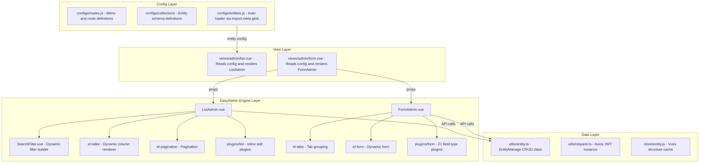

# EasyAdmin Design

> Vue Admin Skeleton — EasyAdmin Engine Design Document  
> Last updated: 2026-07-03

---

## 1. Overview

EasyAdmin is the core CRUD engine of Vue Admin Skeleton. It is a **configuration-driven** system that automatically generates complete CRUD interfaces (list + form + filter + routes) from declarative entity definitions — no boilerplate code required.

### Design Goals

- **Zero boilerplate**: Define config → auto-generate CRUD UI
- **Extensible**: Plugin-based field type system with custom rendering support
- **Metadata-driven**: Automatically infer field types, validation rules, and relations from the backend API
- **Declarative filtering**: DQL expression-driven filter builder
- **Two-tier caching**: Vuex + sessionStorage for entity structure caching

---

## 2. Core Architecture



---

## 3. Data Flow

```mermaid
flowchart TD
    A["User visits entity list route with entityParam"]
    B["views/admin/list.vue - Extract route params entityParam"]
    C["Camelize entityParam and lookup admin.entities by alias"]
    D["Pass config to ListAdmin component"]
    E["ListAdmin created - Create EntityManage instance"]
    F["Call dataProcessor - default em.structure plus em.list"]
    G["Build table columns from list_display config"]
    H["Render el-table"]
    I["User clicks Create - router.push to entity create route"]
    J["views/admin/form.vue - Same entityParam extraction"]
    K["Pass config fields to FormAdmin component"]
    L["FormAdmin created - Create EntityManage instance"]
    M["Call em.structure to get field metadata"]
    N["Transform fields - string to property object"]
    O["Generate validation rules from metadata nullable"]
    P["Build tabs from field tab"]
    Q["If editing - em.retrieve with id to populate form"]
    R["If creating - apply default_value"]
    S["FormAdmin submit - el-form validate"]
    T["cleanBlankAttributes"]
    U["em.create or em.update"]
    V["router.go back one step"]
    A --> B --> C --> D --> E --> F --> G --> H --> I --> J --> K --> L --> M --> N --> O --> P --> Q --> R --> S --> T --> U --> V
```



---

## 4. Plugin System

### 4.1 Plugin Loading Mechanism

```
FormAdmin.loadPlugin(type):
  1. Type normalization:
     'images' → 'image'
     'ManyToOne' → 'RelationToOne'
     'OneToOne' → 'RelationToOne'
     'ManyToMany' → 'RelationToMany'
     'OneToMany' → 'RelationToMany'
  2. Lookup ./plugins/form/{normalizedType}.vue
  3. Not found → fall back to input.vue
  4. Lazy load: defineAsyncComponent()
```

### 4.2 Type Resolution Priority

```
1. field.type (explicitly set in config) — highest priority
2. structure[field.property].metadata.type (backend API metadata)
3. 'input' — final fallback
```

### 4.3 Plugin Props Contract

Each plugin receives:

```typescript
{
  form: Record<string, any>     // Reactive form object
  field: FieldOption             // Current field config
  struct?: {                     // Backend metadata (optional)
    metadata: {
      type: string
      nullable: boolean
      targetEntity?: string
    }
  }
  emPrefix?: string              // API prefix
}
```

Plugins receive additional config via `v-bind="field.type_options"` and `v-on="field.type_events"`.

### 4.4 Plugin List

| Plugin File | Type Mapping | Render Component |
|-------------|--------------|------------------|
| `input.vue` | string (default) | `<el-input>` |
| `textarea.vue` | text | `<el-input type="textarea">` |
| `text.vue` | — | `<Tinymce>` (rich text) |
| `boolean.vue` | boolean | `<el-checkbox>` |
| `integer.vue` | integer | `<el-input-number>` |
| `select.vue` | — | `<el-select>` |
| `date.vue` | date | `<el-date-picker>` (yyyy-MM-dd) |
| `datetime.vue` | datetime | `<el-date-picker>` (yyyy-MM-dd HH:mm:ss) |
| `image.vue` | image | `<el-upload>` (single image, wall mode) |
| `file.vue` | — | `<el-upload>` (single file, Qiniu) |
| `code.vue` | — | `<PrismEditor>` (JS highlight) |
| `json.vue` | — | `<PrismEditor>` (JSON highlight + format) |
| `json_schema.vue` | `json_schema` | Nested generated `<FormAdmin>` with Ajv validation |
| `json-custom.vue` | — | Nested `<FormAdmin>` (sub-object editor) |
| `array.vue` | array | `<el-select multiple>` or nested `<FormAdmin>` |
| `RelationToOne.vue` | ManyToOne, OneToOne | `<el-select>` (remote search) |
| `RelationToMany.vue` | ManyToMany, OneToMany | `<el-select multiple>` (remote search) |
| `transfer.vue` | — | `<el-transfer>` (shuttle box) |

---

## 5. List Column Rendering

### 5.1 Render Priority (ListAdmin)

```
field.component?     → <component :is="field.component">
field.editable?      → <EditablePlain> (inline edit: string/integer/float)
boolean?             → <el-switch> or <el-tag>
date?                → formatted date + icon
datetime?            → formatted datetime + icon
ManyToOne/OneToOne?  → record.__toString
ManyToMany/OneToMany/Array? → <el-tag> list (max 5, tooltip)
image?               → <el-image> (preview)
fallback             → plain text (strip HTML)
```

### 5.2 Relation Field Extraction

```js
// Supports nested property paths
extractFields(dataObject, 'user.profile.phone')
// → dataObject.user.profile.phone
```

---

## 6. Filter System (SearchFilter)

### 6.1 Filter Flow

```
SearchFilter.created():
  filterProcess():
    Iterate listFilter keys
    Async functions → await → transform result
    Reduced style → auto-generate DQL expression
    Full style → use provided expression

User clicks Search:
  filterGenerate():
    Replace :value placeholders
    Merge with base query['@filter'] (using &&)
    Trigger fetchDataFunc()
```

### 6.2 DQL Expression Rules (backend-verified)

Against crud-skeleton `ExpressionDqlParser`:

- Filter paths must use `entity.getX()` chains. Bare property access
  (`entity.status`), `is*`/`has*` getters (`entity.isSystem()`), and bare
  names are not DQL-safe (non-admin → HTTP 403, admin → full-table
  in-memory fallback). Boolean `isSystem` properties are queried as
  `entity.getIsSystem()`.
- Join with `&&` / `||` (never `and` / `or`). Null tests: bare
  `entity.getX()` (`IS NOT NULL`) or `!entity.getX()` (`IS NULL`) —
  never `== null`.
- Sort with `@order` (`field|DIR`, comma-separated). Never `@sort`
  (admin-only in-memory comparator).

### 6.3 Filter Widget Types
| type | Widget |
|------|--------|
| `datetime` / `date` / `time` | `<el-date-picker>` |
| `input` | `<el-input>` (search icon) |
| `boolean` | `<el-switch>` |
| `select` (default) | `<el-select>` (filterable, clearable) |
| custom | `field.component` rendered directly |

---

## 7. EntityManage Class

### 7.1 Constructor

```typescript
constructor(conf: string | {
  name: string      // Entity name (e.g. "Product")
  prefix?: string   // API prefix (default "/api/v1/manage")
  plural?: string   // Plural form (default auto-inferred)
})
```

### 7.2 Pluralization

Uses the `i` (inflect) library:

| Entity Name | Plural Form |
|-------------|-------------|
| Product | products |
| Category | categories |
| Transaction | wallet-transactions |

Can be overridden via `{ plural: 'transactions' }`.

### 7.3 Structure Caching Strategy

```
structure():
  1. Check Vuex store.entity.structures[entityName]
  2. Cache hit → return directly
  3. No cache → GET /system/entities/{fqcn}
  4. Store in Vuex → auto-persist to sessionStorage
  5. sessionStorage key: dream_studio_structures
```

---

## 8. Custom Extension Points

### 8.1 FormAdmin Slots

| Slot | Location | Usage |
|------|----------|-------|
| `formTitle` | Top of form | Custom title area |
| `{field.property}` | Per field position | Override single field rendering |
| Default slot | Bottom of form | Extra content |

### 8.2 ListAdmin Slots

| Slot | Location | Usage |
|------|----------|-------|
| `filter` | Below search bar | Custom filter area |
| `topButton` | Next to create button | Top action buttons |
| `action` | Per row action column | Custom row actions |
| `{field.property}` | Per column position | Override column rendering |
| `extraAction` | End of action column | Extra action buttons |

### 8.3 Custom Components

```js
{
  property: 'amount',
  component: {
    props: ['data'],
    render(h) {
      return <span style={{ color: this.data > 0 ? 'green' : 'red' }}>
        {this.data}
      </span>
    }
  }
}
```

### 8.4 Custom Field Plugins

```
src/easyadmin/ui/vue/plugins/form/my-custom.vue
```

As long as the plugin follows the Plugin Props Contract, it will be automatically discovered and loaded by `import.meta.glob`.
        {this.data}
      </span>
    }
  }
}
```

### 8.4 自定义字段插件

```
src/easyadmin/ui/vue/plugins/form/my-custom.vue
```
只要遵循 plugin props 契约即可自动被 `import.meta.glob` 发现并加载。
